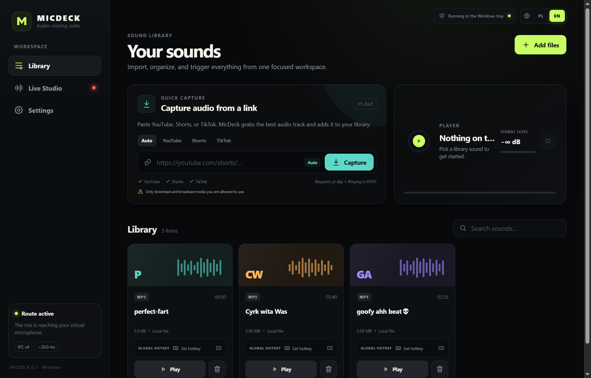
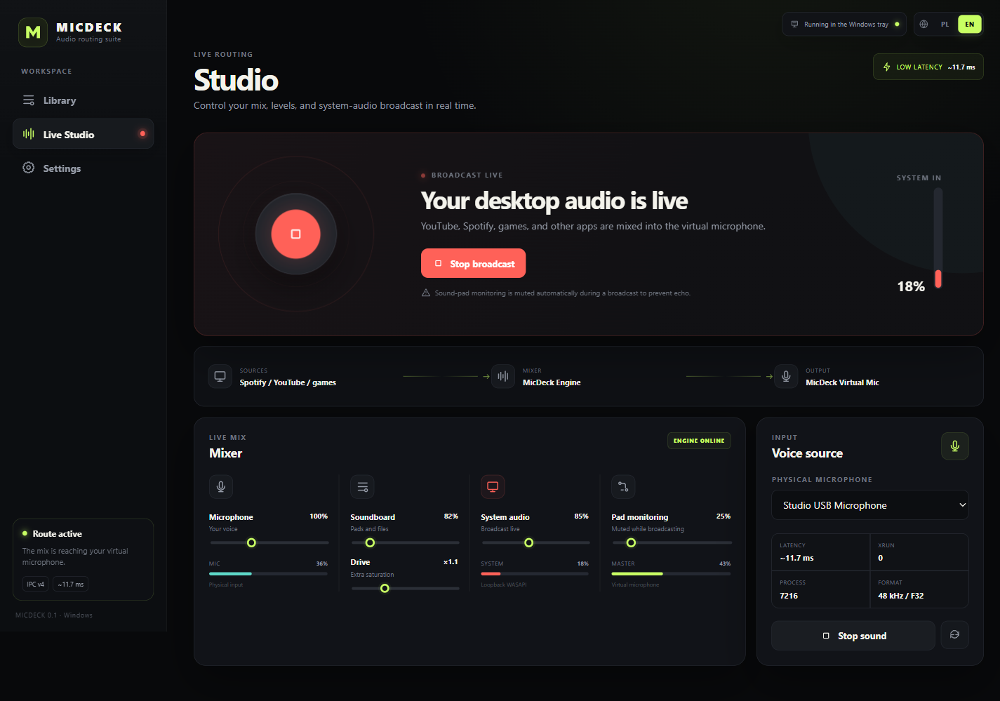
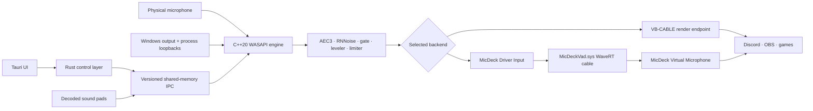

<p align="center">
  
</p>

<h1 align="center">MicDeck</h1>

<p align="center">
  <strong>A Windows audio desk for voice chat, streaming, sound pads, and one managed virtual microphone.</strong>
</p>

<p align="center">
  <a href="README.pl.md">Polski</a> ·
  <a href="https://github.com/3godzinyL/MicDeck/releases/latest">Releases</a> ·
  <a href="#virtual-audio-backends">Audio backends</a> ·
  <a href="#architecture">Architecture</a> ·
  <a href="CHANGELOG.md">Changelog</a>
</p>

---

MicDeck combines a soundboard, physical-microphone processing, Windows audio
capture, application-level mixing, and virtual-microphone routing in one desktop
application. A Rust/Tauri control layer manages the product while a separate
C++20/WASAPI process owns the real-time audio path.

No account, telemetry, cloud mixer, DLL injection, or hooks into third-party
processes.

## Main features

- physical microphone + sound pads + Windows desktop audio in one output mix;
- WebRTC AEC3, RNNoise, smart gate, automatic leveling/compression, and limiter;
- private application levels that affect only the MicDeck/OBS copy;
- MP3, WAV, FLAC, OGG, AAC, and M4A sound pads;
- global per-sound hotkeys;
- YouTube, Shorts, and TikTok Quick Capture through `yt-dlp` + `ffmpeg`;
- event-driven shared-mode WASAPI with `IAudioClient3` fallback handling;
- MMCSS audio threads and fixed-capacity SPSC buffers;
- Polish and English UI;
- close-to-tray and optional start-at-login;
- selectable virtual-audio backend: **VB-CABLE** or **MicDeck VAD**.

## Virtual-audio backends

The backend is selected in **Settings → Virtual microphone** and persisted in
MicDeck's local configuration.

### VB-CABLE compatibility backend

The default backend keeps the existing official VB-CABLE route:

```text
MicDeck C++ mixer
    → WASAPI render to CABLE Input
    → VB-CABLE
    → CABLE Output / renamed MicDeck Virtual Mic
    → Discord, OBS, games, calls
```

MicDeck verifies the embedded official VB-CABLE archive against its pinned
SHA-256 before extraction.

### MicDeck VAD custom backend

The optional custom backend is included as source under
`drivers/micdeck-vad` and can be embedded into a MicDeck build as a signed
`SYS/INF/CAT` package.

```text
Physical microphone ─┐
Sound pads ──────────┼→ C++ DSP + mixer
System/process audio ┘          │
                                ▼
                     MicDeck Driver Input
                         WaveRT render pin
                                │
                                ▼
                         MicDeckVad.sys
                  bounded realtime render→capture cable
                                │
                                ▼
                   MicDeck Virtual Microphone
                         WaveRT capture pin
                                │
                                ▼
                     Discord · OBS · games
```

The driver transports only final PCM audio. AEC3, RNNoise, decoding, process
capture, gains, limiting, and UI logic stay in user mode.

The custom cable includes:

- PortCls/WaveRT render and capture miniports;
- 48 kHz stereo-float internal transport;
- PCM16/PCM24/PCM32/float boundary conversion;
- bounded SPSC ring buffer in nonpaged memory;
- startup priming and three latency policies;
- stale-frame trimming after scheduling spikes;
- fade-in and click-safe fade-to-silence;
- stream discontinuity, watermark, drop, and silence counters;
- versioned KS diagnostics;
- root-enumerated installation helper;
- automatic endpoint rediscovery and native-engine restart on backend changes.

## Interface

<table>
  <tr>
    <td width="50%"></td>
    <td width="50%"></td>
  </tr>
  <tr>
    <td align="center"><strong>Library</strong><br><sub>Sound pads, search, hotkeys, and Quick Capture.</sub></td>
    <td align="center"><strong>Live Studio</strong><br><sub>Microphone, desktop audio, meters, and routing.</sub></td>
  </tr>
  <tr>
    <td colspan="2"></td>
  </tr>
  <tr>
    <td colspan="2" align="center"><strong>Streamer</strong><br><sub>Pre/post-DSP levels, target range, monitoring, and stream-bus gains.</sub></td>
  </tr>
</table>

## First run

1. Start MicDeck.
2. Open **Settings → Virtual microphone**.
3. Keep **VB-CABLE** or select **MicDeck VAD**.
4. Install the selected driver when required.
5. Choose the physical microphone in MicDeck.
6. In Discord, OBS, or a game choose the capture endpoint shown by MicDeck.
7. Add sound pads or enable desktop-audio broadcasting.

Changing the backend stops the previous route, clears cached endpoint IDs,
persists the new choice, and starts the native engine against the selected
render/capture pair.

## Architecture



### Application responsibilities

| Layer | Responsibility |
| --- | --- |
| Tauri/JavaScript | UI, backend selector, settings, library, meters |
| Rust | persistence, endpoint discovery, driver installation, runtime lifecycle |
| C bridge DLL | versioned shared-memory control and Windows integration |
| C++ engine | capture, process loopback, DSP, mixing, event-driven WASAPI render |
| MicDeck VAD | final PCM render-to-capture transport only |

The C++ engine is backend-agnostic. It receives raw render and capture endpoint
IDs from Rust, so no duplicated mixer or DSP implementation is needed for the
custom driver.

## Building from source

Requirements for the application:

- Windows 10/11 x64;
- Node.js and npm;
- Rust stable MSVC toolchain;
- Visual Studio 2022 with **Desktop development with C++**;
- WebView2 Runtime.

The normal build compiles the Rust application, C bridge, C++ audio engine, DSP
library, and MicDeck VAD installation helper automatically:

```powershell
npm ci
npm run build:all
```

### Building MicDeck with the custom driver package

Additional requirements:

- Windows Driver Kit matching the installed Windows SDK;
- a signed `MicDeckVad.sys`, `MicDeckVad.inf`, and `MicDeckVad.cat` package.

One-command source build:

```powershell
npm run build:with-vad
```

Or stage an existing signed package first:

```powershell
.\scripts\stage-micdeck-vad-package.ps1 `
  -PackageDirectory C:\path\to\signed-package `
  -RequireValidKernelSignature

npm run build:all
```

During `cargo build`, `src-tauri/build.rs`:

1. builds the C bridge and C++ engine;
2. builds the fixed-operation elevated driver helper;
3. embeds the staged MicDeck VAD package when present;
4. marks the custom install option available only when all package files exist.

Driver source, portable tests, WDK scripts, package gates, and end-to-end audio
certifier are under `drivers/micdeck-vad`.

## Project layout

```text
src/                         frontend and translations
src-tauri/                   Rust/Tauri control layer
native-audio/                C bridge, C++ WASAPI engine, Rust DSP
src-tauri/resources/vbcable/ official VB-CABLE package
src-tauri/resources/micdeck-vad/package/
                             staged signed MicDeck VAD package
drivers/micdeck-vad/         custom WaveRT driver source and WDK tooling
scripts/                      application and driver build automation
```

## Security and privacy

- live microphone and desktop audio are processed locally;
- no accounts, analytics, or cloud audio service;
- no arbitrary elevated command runner is exposed to the webview;
- the custom-driver helper supports only fixed status/install/repair/uninstall operations;
- the MicDeck VAD package is checked against a generated SHA-256 manifest before elevation;
- endpoint names and IDs are validated before privileged operations;
- the driver does not receive paths, network data, or user-mode pointers through a custom audio IOCTL.

See [SECURITY.md](SECURITY.md) for private vulnerability reporting.

## Third-party software

MicDeck still includes the official unmodified **VB-CABLE Driver Pack 45** as
the default compatibility backend. VB-CABLE is a separate VB-Audio product
under its donationware terms. See [THIRD_PARTY_NOTICES.md](THIRD_PARTY_NOTICES.md).

MicDeck application and custom-driver source are provided under the repository's
[MIT license](LICENSE).

The native C++ engine also monitors the live WASAPI capture/render streams. When Windows Audio restarts or a selected endpoint is invalidated, it closes the dead clients and retries the same route with a one-second backoff.
