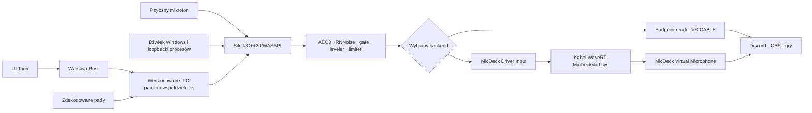

<p align="center">
  
</p>

<h1 align="center">MicDeck</h1>

<p align="center">
  <strong>Windowsowy pulpit audio do Discorda, streamingu, padów dźwiękowych i jednego zarządzanego mikrofonu wirtualnego.</strong>
</p>

<p align="center">
  <a href="README.md">English</a> ·
  <a href="https://github.com/3godzinyL/MicDeck/releases/latest">Wydania</a> ·
  <a href="#backendy-wirtualnego-audio">Backendy audio</a> ·
  <a href="#architektura">Architektura</a> ·
  <a href="CHANGELOG.md">Changelog</a>
</p>

---

MicDeck łączy soundboard, obróbkę fizycznego mikrofonu, przechwytywanie dźwięku
Windows, prywatne poziomy aplikacji oraz routing do mikrofonu wirtualnego.
Rust/Tauri steruje produktem, a osobny proces C++20/WASAPI obsługuje tor
real-time.

Bez konta, telemetrii, miksera chmurowego, wstrzykiwania DLL i hookowania
procesów innych aplikacji.

## Najważniejsze funkcje

- fizyczny mikrofon, pady i dźwięk Windows w jednym miksie;
- WebRTC AEC3, RNNoise, smart gate, leveler/kompresor i limiter;
- poziomy pojedynczych aplikacji zmieniające tylko kopię dla MicDeck/OBS;
- MP3, WAV, FLAC, OGG, AAC i M4A;
- globalne bindy dla każdego dźwięku;
- Quick Capture z YouTube, Shorts i TikToka przez `yt-dlp` + `ffmpeg`;
- event-driven WASAPI i fallback dla `IAudioClient3`;
- wątki MMCSS i bufory SPSC o stałej pojemności;
- polski i angielski interfejs;
- praca w trayu i opcjonalny autostart;
- przełączany backend urządzenia: **VB-CABLE** albo **MicDeck VAD**.

## Backendy wirtualnego audio

Backend wybierasz w **Ustawienia → Wirtualny mikrofon**. Wybór jest zapisywany
w lokalnym configu MicDecka.

### VB-CABLE — tryb zgodności

Domyślna ścieżka zachowuje oficjalny VB-CABLE:

```text
Mikser C++ MicDecka
    → WASAPI render do CABLE Input
    → VB-CABLE
    → CABLE Output / MicDeck Virtual Mic
    → Discord, OBS, gry i rozmowy
```

Przed rozpakowaniem MicDeck sprawdza oficjalne archiwum VB-CABLE względem
przypiętej sumy SHA-256.

### MicDeck VAD — własny sterownik

Źródła własnego sterownika znajdują się w `drivers/micdeck-vad`. Do builda
aplikacji można osadzić podpisany pakiet `SYS/INF/CAT`.

```text
Fizyczny mikrofon ─┐
Pady dźwiękowe ────┼→ DSP i mikser C++
System / aplikacje ┘          │
                              ▼
                   MicDeck Driver Input
                      endpoint render WaveRT
                              │
                              ▼
                       MicDeckVad.sys
             ograniczony kabel render → capture real-time
                              │
                              ▼
                 MicDeck Virtual Microphone
                     endpoint capture WaveRT
                              │
                              ▼
                    Discord · OBS · gry
```

Sterownik transportuje wyłącznie gotowy PCM. AEC3, RNNoise, dekodowanie,
loopbacki procesów, gainy, limiter i UI pozostają w user mode.

Własny kabel zawiera:

- miniport render i capture PortCls/WaveRT;
- wewnętrzny transport 48 kHz stereo float;
- konwersję PCM16/PCM24/PCM32/float na granicy sterownika;
- ograniczony ring buffer SPSC w pamięci nonpaged;
- priming startowy i trzy polityki opóźnienia;
- usuwanie starych ramek po skoku schedulera;
- fade-in oraz bezklikowe zejście do ciszy;
- liczniki discontinuity, watermarków, dropów i ciszy;
- wersjonowaną diagnostykę KS;
- helper instalujący urządzenie root-enumerated;
- ponowne wykrywanie endpointów i restart silnika po zmianie backendu.

## Pierwsze uruchomienie

1. Uruchom MicDeck.
2. Otwórz **Ustawienia → Wirtualny mikrofon**.
3. Zostaw **VB-CABLE** albo wybierz **MicDeck VAD**.
4. Zainstaluj wybrany sterownik, gdy aplikacja tego wymaga.
5. Wybierz fizyczny mikrofon.
6. W Discordzie, OBS lub grze wybierz endpoint capture pokazany przez MicDeck.
7. Dodaj pady albo włącz transmisję dźwięku systemowego.

Zmiana backendu zatrzymuje poprzednią trasę, usuwa zapamiętane ID endpointów,
zapisuje nowy wybór i uruchamia silnik C++ na nowej parze render/capture.

## Architektura



| Warstwa | Odpowiedzialność |
| --- | --- |
| Tauri/JavaScript | UI, przełącznik backendu, ustawienia, biblioteka i mierniki |
| Rust | zapis stanu, wykrywanie endpointów, instalacja sterownika, cykl życia runtime |
| Bridge C | wersjonowane sterowanie IPC i integracja z Windows |
| Silnik C++ | capture, loopbacki, DSP, miksowanie i event-driven render WASAPI |
| MicDeck VAD | wyłącznie transport końcowego PCM z render do capture |

Silnik C++ jest niezależny od backendu. Rust przekazuje mu surowe ID endpointów,
dlatego własny sterownik nie duplikuje miksera ani DSP.

## Build ze źródeł

Wymagania aplikacji:

- Windows 10/11 x64;
- Node.js i npm;
- Rust stable MSVC;
- Visual Studio 2022 z **Desktop development with C++**;
- WebView2 Runtime.

Zwykły build automatycznie kompiluje Rust, bridge C, silnik C++, bibliotekę DSP
i helper instalacyjny MicDeck VAD:

```powershell
npm ci
npm run build:all
```

### Build aplikacji z własnym sterownikiem

Dodatkowo potrzebujesz Windows Driver Kit i podpisanego pakietu
`MicDeckVad.sys`, `MicDeckVad.inf`, `MicDeckVad.cat`.

Pełny build jednym poleceniem:

```powershell
npm run build:with-vad
```

Albo osadzenie gotowego podpisanego pakietu:

```powershell
.\scripts\stage-micdeck-vad-package.ps1 `
  -PackageDirectory C:\sciezka\do\pakietu `
  -RequireValidKernelSignature

npm run build:all
```

Podczas `cargo build`, `src-tauri/build.rs`:

1. kompiluje bridge C oraz silnik C++;
2. kompiluje helper UAC o ograniczonych operacjach;
3. osadza pakiet MicDeck VAD, jeżeli został przygotowany;
4. aktywuje przycisk instalacji własnego sterownika wyłącznie przy kompletnym pakiecie.

Źródła sterownika, testy przenośne, skrypty WDK, bramki pakietu i certyfikator
audio end-to-end znajdują się w `drivers/micdeck-vad`.

## Układ projektu

```text
src/                         frontend i tłumaczenia
src-tauri/                   Rust/Tauri
native-audio/                bridge C, silnik C++/WASAPI i DSP Rust
src-tauri/resources/vbcable/ oficjalna paczka VB-CABLE
src-tauri/resources/micdeck-vad/package/
                             osadzany pakiet własnego sterownika
drivers/micdeck-vad/         źródła WaveRT i narzędzia WDK
scripts/                      automatyzacja builda aplikacji i sterownika
```

## Prywatność i bezpieczeństwo

- dźwięk mikrofonu i systemu jest przetwarzany lokalnie;
- brak kont, analytics i usługi audio w chmurze;
- webview nie ma dostępu do ogólnego command runnera z uprawnieniami administratora;
- helper sterownika przyjmuje wyłącznie status/install/repair/uninstall;
- pakiet MicDeck VAD jest sprawdzany względem manifestu SHA-256 przed UAC;
- nazwy i ID endpointów są walidowane;
- sterownik nie przyjmuje ścieżek, danych sieciowych ani arbitralnych wskaźników user mode przez własny IOCTL audio.

Podatności zgłaszaj zgodnie z [SECURITY.md](SECURITY.md).

## VB-CABLE i licencje

MicDeck nadal zawiera oficjalny, niezmodyfikowany **VB-CABLE Driver Pack 45**
jako domyślny backend zgodności. VB-CABLE jest oddzielnym produktem VB-Audio
udostępnianym w modelu donationware. Szczegóły znajdują się w
[THIRD_PARTY_NOTICES.md](THIRD_PARTY_NOTICES.md).

Kod aplikacji MicDeck i źródła własnego sterownika są dostępne na warunkach
repozytorium [MIT](LICENSE).

Natywny silnik C++ monitoruje również działające strumienie WASAPI. Po restarcie Windows Audio lub unieważnieniu endpointu zamyka martwe klienty i automatycznie ponawia tę samą trasę z sekundowym backoffem.
