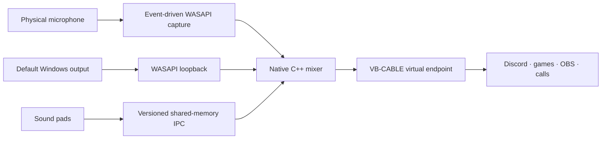

<p align="center">
  
</p>

<h1 align="center">MicDeck</h1>

<p align="center">
  <strong>A focused Windows audio desk for voice chat.</strong>
  <br>
  Trigger sound clips, share what your PC is playing, and send the complete mix through one virtual microphone.
</p>

<p align="center">
  <a href="README.pl.md">Polski</a>
  ·
  <a href="https://github.com/3godzinyL/MicDeck/releases/latest">Download</a>
  ·
  <a href="#signal-path">Signal path</a>
  ·
  <a href="#current-scope">Current scope</a>
  ·
  <a href="CHANGELOG.md">Changelog</a>
</p>

<p align="center">
  <a href="https://github.com/3godzinyL/MicDeck/actions/workflows/ci.yml"></a>
  <a href="https://github.com/3godzinyL/MicDeck/releases/latest"></a>
  
  
  <a href="LICENSE"></a>
</p>

---

MicDeck combines a soundboard, Windows output capture, and virtual-microphone routing in one application. The interface stays deliberately small; a separate native C++/WASAPI process owns the real-time audio path.

No account. No telemetry. No cloud mixer. No code injection or process hooks.

## At a glance

| | Current public preview |
| --- | --- |
| Platform | Windows 10/11 x64 |
| Inputs | Physical microphone, sound pads, default Windows output |
| Output | One managed virtual microphone through the official VB-CABLE driver |
| Audio core | C++20, event-driven WASAPI shared mode, MMCSS scheduling |
| Control layer | Rust + Tauri 2 |
| Internal stream | 48 kHz, stereo, 32-bit float |
| Live-audio network use | None |
| Interface | English and Polish |

### Features

- **System audio in one click** — route a browser, Spotify, a game, or the complete Windows render mix into voice chat.
- **Sound pads** — import and play MP3, WAV, FLAC, OGG, AAC, and M4A files.
- **Per-sound global hotkeys** — record combinations such as `Alt+P` and trigger clips while MicDeck is hidden in the tray.
- **Quick Capture** — add audio from supported YouTube, YouTube Shorts, and TikTok URLs.
- **Responsive imports** — downloads, decoding, and metadata analysis run outside the UI thread.
- **Live Studio** — control microphone, pad, system-audio, and monitoring levels from one view.
- **Visible diagnostics** — inspect negotiated latency, signal levels, engine state, process ID, and underruns.
- **Windows integration** — optional launch at sign-in, close-to-tray behavior, and persistent background routing.
- **Local-first operation** — live audio never leaves the machine through a MicDeck service.

> [!IMPORTANT]
> MicDeck is an early public preview. The builds are not code-signed yet, so Windows SmartScreen may display an unknown-publisher warning. Download releases only from this repository and verify the supplied `SHA256SUMS.txt`.

## Interface

<table>
  <tr>
    <td width="50%">
      
    </td>
    <td width="50%">
      
    </td>
  </tr>
  <tr>
    <td align="center"><strong>Library</strong><br><sub>Sound pads, global hotkeys, search, playback, and background imports.</sub></td>
    <td align="center"><strong>Live Studio</strong><br><sub>Microphone, system audio, meters, monitoring, and routing state.</sub></td>
  </tr>
  <tr>
    <td colspan="2">
      
    </td>
  </tr>
  <tr>
    <td colspan="2" align="center"><strong>Windows integration</strong><br><sub>Virtual device setup, engine diagnostics, autostart, system tray, and Discord guidance.</sub></td>
  </tr>
</table>

## Download

Download the latest files from [GitHub Releases](https://github.com/3godzinyL/MicDeck/releases/latest):

| File | Use case |
| --- | --- |
| `MicDeck-Setup.exe` | Recommended per-user Windows installer. |
| `MicDeck-portable.exe` | Portable application build. The audio driver may still require installation. |
| `SHA256SUMS.txt` | SHA-256 checksums for both executables. |

Verify a downloaded file in PowerShell:

```powershell
Get-FileHash .\MicDeck-Setup.exe -Algorithm SHA256
```

Compare the result with the matching line in `SHA256SUMS.txt`.

### First run

1. Start MicDeck.
2. Open **Settings** and install the official VB-CABLE driver if no compatible virtual endpoint is available.
3. Select your real physical microphone.
4. In Discord, a game, OBS, or another voice application, select **MicDeck Virtual Mic** as the input.
5. Add a sound or open **Live Studio** and enable system-audio sharing.
6. Optionally assign global hotkeys and enable **Launch at sign-in**.

Closing the main window keeps MicDeck in the Windows notification area and does not stop the audio route. Use **Quit / Zakończ** from the tray menu to exit normally.

> [!TIP]
> Discord's Noise Suppression, Echo Cancellation, and Automatic Gain Control are designed for speech. If they cut music or effects, reduce or disable them for the MicDeck input.

## Signal path



### Real-time audio core

The native engine is intentionally separated from the webview and application state:

- `IAudioClient3` negotiates a low shared-mode engine period supported by each endpoint.
- Classic WASAPI initialization provides a safe fallback when `IAudioClient3` is unavailable.
- Capture and render use `AUDCLNT_STREAMFLAGS_EVENTCALLBACK`, not timer-based polling.
- Audio threads join Windows MMCSS with elevated `Audio` / `Pro Audio` scheduling.
- Fixed-capacity SPSC ring buffers use acquire/release atomics between producers and consumers.
- The mixing hot path uses fixed buffers and performs no UI work.
- The Studio view reports the measured configuration estimate and underruns instead of promising one universal latency value.

Actual end-to-end latency depends on the physical device, its driver, the virtual endpoint, and the voice application. MicDeck does not advertise a fabricated fixed millisecond figure.

### Application and worker layer

Rust/Tauri owns window and tray lifecycle, settings, the sound library, virtual-device setup, and communication with the native engine. Downloads, file decoding, and waveform analysis are dispatched to background blocking workers. The interface receives progress events and refreshes only after prepared metadata is ready.

The native engine and IPC bridge are compiled during the Rust build and embedded into the main executable. At runtime they are restored into a content-addressed directory under `%LOCALAPPDATA%\micdeck\native\<hash>`; existing files are compared with the embedded bytes before reuse.

## Current scope

This section is deliberately explicit. These are preview boundaries, not hidden claims.

| Area | What v0.1 currently does |
| --- | --- |
| System capture | Captures the complete default Windows render mix. Per-application capture is planned, not implemented. |
| WASAPI mode | Uses adaptive shared mode. Exclusive-mode access is not claimed. |
| Monitoring | Local sound-pad monitoring is muted while system-audio broadcast is active to prevent a feedback loop. The outgoing virtual mix still contains the pads. |
| Device changes | Engine state and errors are visible in Studio and Settings. A manual **Restart audio engine** action is available when a device or driver is reconfigured. |
| Default-device restoration | Previous capture defaults are restored on a normal MicDeck/engine shutdown when the managed endpoint is still active. A forced process termination, Windows crash, or power loss cannot guarantee restoration; verify the Windows input afterward. |
| DSP | The preview provides gain control and soft saturation. It does not yet include VST hosting, noise suppression, a noise gate, or a full mastering chain. |
| Distribution | Binaries and checksums are published, but Authenticode signing and automatic updates remain roadmap items. |
| Architecture | Windows x64 only. No macOS, Linux, ARM64, mobile remote, Stream Deck, or MIDI support is claimed in this release. |

## Quick Capture

Supported sources:

- `youtube.com/watch/...`
- `youtube.com/shorts/...`
- `youtu.be/...`
- `tiktok.com/...`

URL import requires [`yt-dlp`](https://github.com/yt-dlp/yt-dlp) and [`FFmpeg`](https://ffmpeg.org/) in `PATH`. Run `scripts\install-tools.bat` to install both into the local tools directory.

MicDeck starts these tools as child processes with argument lists; it does not build a shell command from the pasted URL. Imports connect directly to the requested platform and are not proxied through a MicDeck service.

Only download and broadcast media you are allowed to use. MicDeck does not bypass platform permissions, DRM, or copyright restrictions and does not grant rights to third-party content.

## Privacy and security

- Live microphone, sound-pad, and system audio is processed locally.
- MicDeck has no account system, analytics SDK, telemetry endpoint, or cloud audio service.
- It does not inject DLLs, hook another application's process, or capture per-process memory.
- The Tauri webview receives a narrow capability allow-list for core window operations, autostart, file selection, and global shortcuts.
- Native audio IPC uses a versioned mapping in the Windows local-session namespace and is not exposed as a network service.
- The official VB-CABLE archive is verified against the SHA-256 recorded in the source before extraction.
- Temporary driver files are removed after the installer exits.

The current executables are unsigned. Code signing is the largest remaining distribution-hardening item, not something the project attempts to hide.

Please report vulnerabilities privately according to [SECURITY.md](SECURITY.md). Do not open a public issue for a suspected vulnerability.

## VB-CABLE and third-party software

MicDeck bundles the official, unmodified **VB-CABLE Driver Pack 45**. VB-CABLE remains a separate VB-Audio product distributed under its donationware model.

VB-Audio's published terms explicitly allow the standard VB-CABLE package to be distributed with another application when the vendor, origin, and donationware model remain visible. MicDeck provides that attribution in the interface and in [THIRD_PARTY_NOTICES.md](THIRD_PARTY_NOTICES.md). Professional and volume deployments may require paid licensing under the vendor's current terms.

- [VB-CABLE product page](https://vb-audio.com/Cable/)
- [VB-Audio distribution and licensing terms](https://vb-audio.com/Services/licensing.htm)
- [Complete third-party notices](THIRD_PARTY_NOTICES.md)

`yt-dlp` and FFmpeg are optional external tools. They are installed separately, are not linked into MicDeck, and retain their own licenses.

## Build from source

### Requirements

- Windows 10 or 11 x64
- Node.js 24+
- Rust stable with the MSVC toolchain
- Visual Studio 2022 Build Tools with **Desktop development with C++**
- Microsoft Edge WebView2 Runtime
- Optional: `yt-dlp` and FFmpeg for URL import

### Development

```powershell
npm ci
npm run tauri dev
```

### Production

```powershell
npm run build:portable
npm run build:installer
```

Or build both:

```powershell
npm run build:all
```

Artifacts are written to `release\`.

### Validation

```powershell
npm audit --audit-level=high
npm run build
cargo fmt --manifest-path src-tauri\Cargo.toml --all -- --check
cargo test --manifest-path src-tauri\Cargo.toml --locked
cargo clippy --manifest-path src-tauri\Cargo.toml --all-targets --locked -- -D warnings
```

The same checks run on `windows-latest` through [`.github/workflows/ci.yml`](.github/workflows/ci.yml). The native audio core also includes a hardware-independent self-test under `native-audio\selftest`.

## Project layout

```text
src/                    Tauri web UI, localization, and interaction layer
src-tauri/              Rust application state, workers, persistence, and lifecycle
native-audio/engine/    C++20 WASAPI capture, loopback, mixing, monitoring, and render
native-audio/bridge/    Versioned shared-memory IPC bridge
native-audio/selftest/  Hardware-independent native audio tests
scripts/                Build, dependency, and diagnostic helpers
docs/                   Screenshots, release notes, and launch artwork
.github/                 CI, issue forms, and contribution templates
```

## Roadmap

- [ ] Per-application audio capture
- [ ] Device-change recovery and stronger crash-safe default-device restoration
- [ ] Normalization, threshold limiter, and lightweight EQ
- [ ] Multiple decks and profiles
- [ ] Stream Deck and MIDI control
- [ ] Authenticode-signed builds and automatic updates
- [ ] Additional community translations

The roadmap is intentionally focused. A full DAW, VST host, mobile application, and custom kernel audio driver are not prerequisites for a useful, stable MicDeck release.

## Contributing

Bug reports, reproducible audio-device edge cases, accessibility improvements, documentation fixes, and focused pull requests are welcome.

Read [CONTRIBUTING.md](CONTRIBUTING.md) before opening a pull request. Use the provided issue forms and include MicDeck's engine status, Windows version, device names, negotiated latency, and underrun count when reporting audio problems.

## License

MicDeck source code is available under the [MIT License](LICENSE). Bundled and optional third-party components retain their own licenses and distribution terms.

---

<p align="center">
  <strong>If MicDeck simplifies your voice-chat audio setup, consider starring the repository.</strong>
  <br>
  Stars help other Windows audio users discover the project.
</p>
