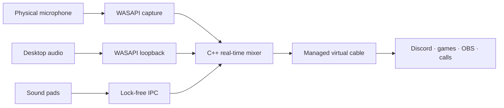

<p align="center">
  
</p>

<h1 align="center">MicDeck</h1>

<p align="center">
  <strong>The native Windows soundboard and system-audio router built for voice chat.</strong>
  <br>
  Trigger clips, share anything playing on your PC, and send the final mix through one virtual microphone.
</p>

<p align="center">
  <a href="README.pl.md">Polski</a>
  ·
  <a href="#download">Download</a>
  ·
  <a href="#how-it-works">How it works</a>
  ·
  <a href="CHANGELOG.md">Changelog</a>
  ·
  <a href="CONTRIBUTING.md">Contribute</a>
</p>

<p align="center">
  
  
  
  
  
</p>

---

MicDeck replaces the usual stack of a soundboard, a loopback recorder, and a complicated virtual mixer. It keeps the control surface simple while a native C++/WASAPI engine handles the real-time audio path underneath.

- **One-click system audio:** send YouTube, Spotify, a game, or any other desktop audio into Discord and voice chat.
- **Instant sound pads:** play MP3, WAV, FLAC, OGG, AAC, and M4A clips from a focused live deck.
- **Per-sound global hotkeys:** assign combinations such as `Alt+P` and trigger any clip while MicDeck is in the tray.
- **Quick Capture:** paste a YouTube, YouTube Shorts, or TikTok URL and add its audio to the library.
- **Responsive background imports:** downloads, decoding, and waveform analysis run away from the UI thread.
- **Mic + clips + desktop:** combine every source into one clean virtual microphone.
- **Adaptive low latency:** negotiate a device-specific shared-mode period through `IAudioClient3` instead of forcing a fixed 70 ms buffer.
- **Built for Windows:** launch at sign-in, start quietly in the system tray, and keep the audio route alive when the window closes.
- **Bilingual interface:** switch the entire app between English and Polish from the top-right language control.
- **Local-first:** no account, telemetry, cloud mixer, DLL injection, or process hooks.

> [!NOTE]
> MicDeck is an early public preview for Windows 10/11 x64. The current binaries are not code-signed yet, so Windows SmartScreen may show a warning.

## See it in action

<table>
  <tr>
    <td width="50%">
      
    </td>
    <td width="50%">
      
    </td>
  </tr>
  <tr>
    <td align="center"><strong>Library</strong><br><sub>Sound pads, search, playback controls, and URL capture.</sub></td>
    <td align="center"><strong>Live Studio</strong><br><sub>Mic, system audio, meters, monitoring, and routing status.</sub></td>
  </tr>
  <tr>
    <td colspan="2">
      
    </td>
  </tr>
  <tr>
    <td colspan="2" align="center"><strong>Windows-native setup</strong><br><sub>Virtual device, engine diagnostics, launch at sign-in, system tray, and Discord guidance.</sub></td>
  </tr>
</table>

## Download

Open the repository's **Releases** section and download one of these files:

| Build | Best for |
| --- | --- |
| `MicDeck-Setup.exe` | Recommended. Installs MicDeck for the current Windows user. |
| `MicDeck-portable.exe` | Runs without installing the app itself. The virtual audio driver may still require setup. |

### First run

1. Start MicDeck and allow the official VB-CABLE driver installer if Windows asks for it.
2. Open **Settings** and select your real physical microphone.
3. In Discord, a game, or another voice app, choose **MicDeck Virtual Mic** as the input device.
4. Add a clip or open **Live Studio** and enable system-audio sharing.
5. Click **Set hotkey** on a sound card to record an optional global shortcut.
6. Optionally enable **Launch at sign-in** under **Settings → Windows integration**.

That is the whole signal chain. Closing the window keeps MicDeck available from the Windows notification area; use **Quit / Zakończ** from the tray menu to stop it completely. MicDeck restores your previous Windows audio defaults when it exits normally, and its watchdog also handles an unexpected engine shutdown.

## What makes it different

| | MicDeck | Typical setup |
| --- | --- | --- |
| Soundboard + system audio | One interface | Separate apps |
| Real-time path | Native C++ / WASAPI | General-purpose mixer graph |
| Buffer strategy | Adaptive `IAudioClient3` period | Static buffer |
| Voice-chat output | One managed virtual mic | Manual cable routing |
| External media capture | Built-in URL workflow | Download and convert by hand |
| Clip shortcuts | Persistent per-sound global hotkeys | Requires app focus or extra tooling |
| Windows integration | Autostart + close-to-tray | Varies by tool |
| Process access | No injection or hooks | Depends on the tool |

### Quick Capture

Paste a supported URL into the Library:

- `youtube.com/watch/...`
- `youtube.com/shorts/...`
- `youtu.be/...`
- `tiktok.com/...`

URL import requires [`yt-dlp`](https://github.com/yt-dlp/yt-dlp) and [`ffmpeg`](https://ffmpeg.org/) in `PATH`. Run `scripts\install-tools.bat` to install both into a local tools directory.

Only download and broadcast media you are allowed to use. MicDeck does not bypass platform permissions or grant rights to third-party content.

### Broadcast desktop audio

Open **Live Studio**, enable **Share system audio**, and set the level. MicDeck captures the Windows render mix through WASAPI loopback, combines it with your mic and active sound pads, then sends the result to the virtual input.

If Discord cuts music or effects, disable or reduce Echo Cancellation, Noise Suppression, and Automatic Gain Control. Those voice filters are designed to remove non-speech audio.

## How it works



The Tauri/Rust process owns the UI, library, persistence, downloads, and driver lifecycle. Downloads, file decoding, and waveform analysis are dispatched to blocking worker threads, so the webview remains responsive and refreshes only when prepared metadata is ready. A separate C++20 engine owns event-driven capture, loopback, mixing, monitoring, and render. A versioned shared-memory bridge keeps UI work away from the real-time thread.

### Latency model

MicDeck asks each endpoint for its supported shared-mode engine periods and selects a low, stable period close to the device minimum. If `IAudioClient3` is unavailable, it falls back to the device's safe default period. The Studio view reports the current estimate and underruns so low latency never becomes a blind promise.

## Build from source

### Requirements

- Windows 10 or 11 x64
- Node.js 24+
- Rust stable with the MSVC toolchain
- Visual Studio 2022 Build Tools with **Desktop development with C++**
- Microsoft Edge WebView2 Runtime
- Optional: `yt-dlp` and `ffmpeg` for URL import

### Development

```powershell
npm ci
npm run tauri dev
```

### Production builds

```powershell
npm run build:portable
npm run build:installer
```

Or double-click `scripts\build.bat` to create both artifacts in `release\`.

### Tests

```powershell
npm run build
cargo test --manifest-path src-tauri\Cargo.toml --locked
```

The native audio core also has a hardware-free C++ self-test in `native-audio\selftest`.

## Project layout

```text
src/                    Tauri web UI and interaction layer
src-tauri/              Rust application, persistence, driver lifecycle
native-audio/engine/    C++20 WASAPI capture, loopback, mix, and render
native-audio/bridge/    Versioned shared-memory IPC bridge
native-audio/selftest/  Hardware-free audio core tests
scripts/                Build, tools, and diagnostics
docs/                   Screenshots and launch artwork
```

## Roadmap

- [ ] Per-application audio capture
- [ ] Normalization, limiter, and lightweight EQ
- [ ] Multiple decks and profiles
- [ ] Stream Deck and MIDI control
- [ ] Signed builds and automatic updates
- [ ] More community translations

Have a better idea? Start a GitHub Discussion or open a feature request.

## Privacy and security

MicDeck processes live audio locally. It does not inject code into other applications, hook their processes, or upload audio to a MicDeck service. URL imports connect directly to the requested platform through external tools.

Please report vulnerabilities privately as described in [SECURITY.md](SECURITY.md).

## Contributing

Bug reports, audio-device edge cases, UI improvements, documentation, and pull requests are welcome. Read [CONTRIBUTING.md](CONTRIBUTING.md) before opening a PR and use the included issue templates so reports contain the diagnostics needed to reproduce audio problems.

## Third-party software

MicDeck can install the official, unmodified VB-CABLE Driver Pack 45 by VB-Audio. VB-CABLE is donationware and remains a separate third-party product. See [THIRD_PARTY_NOTICES.md](THIRD_PARTY_NOTICES.md) and the vendor's [licensing terms](https://vb-audio.com/Services/licensing.htm).

## License

MicDeck source code is available under the [MIT License](LICENSE). Bundled third-party components keep their own licenses and terms.

---

<p align="center">
  <strong>If MicDeck makes your voice-chat setup simpler, give the repository a star.</strong>
  <br>
  Stars help other Windows audio users find the project.
</p>
