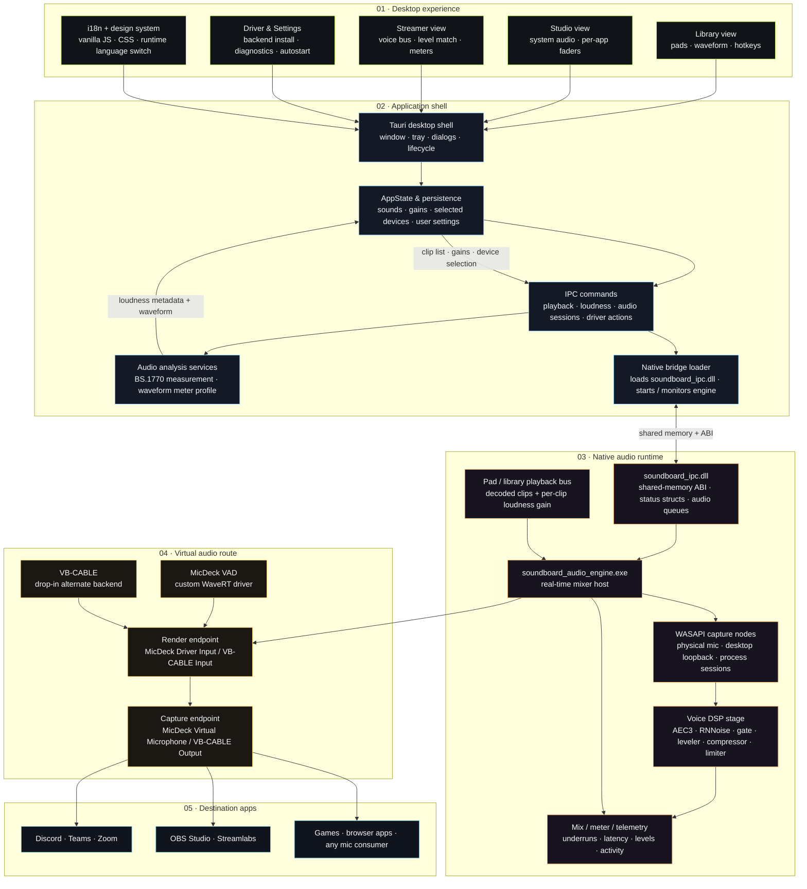
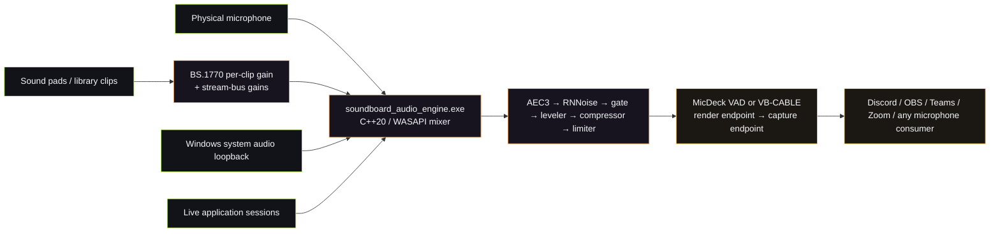

<p align="center">
  
</p>

<h1 align="center">MicDeck</h1>

<p align="center">
  <strong>A Windows soundboard, virtual microphone, system-audio router and live voice desk — built around a native C++ audio engine and a custom WaveRT driver.</strong>
  <br>
  Fire sound clips, broadcast desktop audio, level every source to one target loudness,
  <br>
  and deliver the whole mix to Discord, OBS, Teams, Zoom or any app that accepts a microphone.
</p>

<p align="center">
  <a href="README.pl.md">Polski</a>
  ·
  <a href="#loudness-matching">Loudness matching</a>
  ·
  <a href="#architecture-at-a-glance">Architecture</a>
  ·
  <a href="#the-micdeck-vad-driver">The driver</a>
  ·
  <a href="#signal-path">Signal path</a>
  ·
  <a href="#project-architecture-map">Full architecture map</a>
  ·
  <a href="#build-from-source">Build</a>
  ·
  <a href="CHANGELOG.md">Changelog</a>
</p>

<p align="center">
  <a href="https://github.com/3godzinyL/Virtual-Soundboard-Audio-Windows-Mixer/actions/workflows/ci.yml"></a>
  
  
  
  
  
  <a href="LICENSE"></a>
</p>

---

MicDeck brings together four things that are usually scattered across separate tools:

- a **Windows soundboard** with pads and global hotkeys,
- a **virtual microphone** / **virtual audio cable** output path,
- a **desktop audio broadcaster** for music, games and browser audio,
- and a **live voice-processing desk** with loudness control, microphone cleanup and per-app mixing.

The interface stays lightweight on purpose. The real-time audio path runs in a separate native
**C++20 / WASAPI** process, the desktop shell is **Rust + Tauri 2**, and the virtual route is
provided by **MicDeck VAD**, a custom **kernel-mode WaveRT** driver, with **VB-CABLE** available
as an alternative backend.

**No account. No telemetry. No cloud mixer. No code injection. No process hooks.**

## At a glance

| | |
| --- | --- |
| Platform | Windows 10 2004+ / Windows 11, x64 |
| Core use case | Soundboard + Windows mixer + desktop audio broadcast + virtual microphone |
| Inputs | Physical microphone, library clips, default Windows output, live application sessions |
| Outputs | One virtual microphone route for Discord, OBS, Teams, Zoom, Steam Voice and similar apps |
| Loudness | ITU-R BS.1770-4 analysis, per-clip gain, live microphone level matching |
| Real-time engine | Separate C++20 / WASAPI process, shared-memory IPC, 48 kHz float pipeline |
| Shell | Rust + Tauri 2 backend, vanilla-JS front end |
| Languages | English and Polish, switchable at runtime |
| Driver model | MicDeck VAD (WaveRT) or VB-CABLE backend |

## Why MicDeck

MicDeck is designed for people who want a serious Windows audio workflow without stacking five
separate utilities just to do one stream or one voice session. It is especially useful when you
need any mix of the following:

- **soundboard clips through one microphone**,
- **desktop audio into Discord or OBS**,
- **microphone cleanup and voice control**,
- **loudness-normalised pads** so quiet and loud clips sit at one level,
- **per-application live volume control**,
- **a native, low-latency path** instead of routing everything through a browser or an Electron-only stack.

## Highlights

### Loudness matching

Every clip is analysed with a full **ITU-R BS.1770-4** implementation — K-weighting filters
re-derived from the analog prototype, 400 ms blocks with 75% overlap, and the two-stage
absolute / relative gate. The **Levels** tab stores a per-clip loudness value and applies a
calculated gain so clips land on the same perceived level without pushing them through the peak
ceiling.

<p align="center">
  
</p>

> The example above spans **18.9 LU** between the quietest and the loudest clip.
> After loudness matching, the spread is collapsed to **0.2 LU**.

When **microphone level match** is enabled, the same loudness target can also steer the live
voice path, so speech, sound pads and desktop audio arrive on the output bus as one coherent mix.

## Architecture at a glance

The diagram below shows the actual runtime split of MicDeck: UI, Rust shell, shared-memory IPC,
native audio core, DSP stage, virtual-audio backends and the final microphone route.


```mermaid
flowchart TB
    classDef ui fill:#111318,stroke:#c8ff63,color:#f5f7fa,stroke-width:1px;
    classDef rust fill:#131a26,stroke:#88d1ff,color:#f5f7fa,stroke-width:1px;
    classDef native fill:#17141f,stroke:#f2a65a,color:#f5f7fa,stroke-width:1px;
    classDef driver fill:#1b1713,stroke:#ffd166,color:#f5f7fa,stroke-width:1px;
    classDef ext fill:#10151d,stroke:#8bd3dd,color:#f5f7fa,stroke-width:1px;
    classDef flow fill:#202733,stroke:#9ca3af,color:#f5f7fa,stroke-width:1px;

    subgraph UX["01 · Desktop experience"]
        UI1["Library view<br/>pads · waveform · hotkeys"]:::ui
        UI2["Studio view<br/>system audio · per-app faders"]:::ui
        UI3["Streamer view<br/>voice bus · level match · meters"]:::ui
        UI4["Driver & Settings<br/>backend install · diagnostics · autostart"]:::ui
        UI5["i18n + design system<br/>vanilla JS · CSS · runtime language switch"]:::ui
    end

    subgraph SHELL["02 · Application shell"]
        RS1["Tauri desktop shell<br/>window · tray · dialogs · lifecycle"]:::rust
        RS2["AppState & persistence<br/>sounds · gains · selected devices · user settings"]:::rust
        RS3["IPC commands<br/>playback · loudness · audio sessions · driver actions"]:::rust
        RS4["Audio analysis services<br/>BS.1770 measurement · waveform meter profile"]:::rust
        RS5["Native bridge loader<br/>loads soundboard_ipc.dll · starts / monitors engine"]:::rust
    end

    subgraph CORE["03 · Native audio runtime"]
        NA1["soundboard_audio_engine.exe<br/>real-time mixer host"]:::native
        NA2["WASAPI capture nodes<br/>physical mic · desktop loopback · process sessions"]:::native
        NA3["Voice DSP stage<br/>AEC3 · RNNoise · gate · leveler · compressor · limiter"]:::native
        NA4["Pad / library playback bus<br/>decoded clips + per-clip loudness gain"]:::native
        NA5["Mix / meter / telemetry<br/>underruns · latency · levels · activity"]:::native
        NA6["soundboard_ipc.dll<br/>shared-memory ABI · status structs · audio queues"]:::native
    end

    subgraph BACKENDS["04 · Virtual audio route"]
        VD1["MicDeck VAD<br/>custom WaveRT driver"]:::driver
        VD2["VB-CABLE<br/>drop-in alternate backend"]:::driver
        VD3["Render endpoint<br/>MicDeck Driver Input / VB-CABLE Input"]:::driver
        VD4["Capture endpoint<br/>MicDeck Virtual Microphone / VB-CABLE Output"]:::driver
    end

    subgraph APPS["05 · Destination apps"]
        EX1["Discord · Teams · Zoom"]:::ext
        EX2["OBS Studio · Streamlabs"]:::ext
        EX3["Games · browser apps · any mic consumer"]:::ext
    end

    UI1 --> RS1
    UI2 --> RS1
    UI3 --> RS1
    UI4 --> RS1
    UI5 --> RS1

    RS1 --> RS2 --> RS3
    RS3 --> RS4
    RS3 --> RS5
    RS5 <-->|shared memory + ABI| NA6
    NA6 --> NA1
    NA1 --> NA2
    NA2 --> NA3
    NA4 --> NA1
    NA3 --> NA5
    NA1 --> NA5
    RS4 -->|loudness metadata + waveform| RS2
    RS2 -->|clip list · gains · device selection| RS3

    NA1 --> VD3
    VD1 --> VD3
    VD2 --> VD3
    VD3 --> VD4
    VD4 --> EX1
    VD4 --> EX2
    VD4 --> EX3
```

## The MicDeck VAD driver

MicDeck includes its own **WaveRT virtual audio driver** so the application can expose a native
virtual route instead of relying entirely on external tools. The driver stack presents a render
endpoint and a capture endpoint connected by a lock-free ring in non-paged pool, with runtime
latency modes, live statistics and a clean integration path for the MicDeck UI.

<p align="center">
  
</p>

The Driver tab gives you a practical control surface for the route itself:

- select **MicDeck VAD** or **VB-CABLE**,
- install or switch backends,
- probe both endpoints,
- inspect route state,
- rename the virtual microphone,
- and keep the audio path visible from the same desktop shell as the mixer.

## Everything else

- **Soundboard** with waveform previews, hotkeys and one-click playback.
- **Quick Capture** — paste a YouTube / Shorts / TikTok link and import the audio to the library.
- **System audio broadcast** — route games, music, browsers or media players to the same output bus.
- **Per-application volume** — view live sessions and control their levels individually.
- **Voice DSP chain** — AEC3, RNNoise, noise gate, auto-leveller, compressor and limiter.
- **Tray-resident desktop utility** with autostart support and a compact Tauri shell.

## Interface

<table>
  <tr>
    <td width="50%"></td>
    <td width="50%"></td>
  </tr>
  <tr>
    <td align="center"><strong>Library</strong> — pads, hotkeys, Quick Capture</td>
    <td align="center"><strong>Studio</strong> — live mixer, session rack and desktop audio broadcast</td>
  </tr>
  <tr>
    <td width="50%"></td>
    <td width="50%"></td>
  </tr>
  <tr>
    <td align="center"><strong>Streamer</strong> — calibration, meters and level match</td>
    <td align="center"><strong>Settings</strong> — engine, integration and system controls</td>
  </tr>
</table>

## Signal path


```mermaid
flowchart LR
    classDef audio fill:#111318,stroke:#c8ff63,color:#f5f7fa,stroke-width:1px;
    classDef proc fill:#17141f,stroke:#f2a65a,color:#f5f7fa,stroke-width:1px;
    classDef out fill:#1b1713,stroke:#ffd166,color:#f5f7fa,stroke-width:1px;

    MIC["Physical microphone"]:::audio
    PADS["Sound pads / library clips"]:::audio
    SYS["Windows system audio loopback"]:::audio
    APPS["Live application sessions"]:::audio

    MIX["soundboard_audio_engine.exe<br/>C++20 / WASAPI mixer"]:::proc
    DSP["AEC3 → RNNoise → gate → leveler → compressor → limiter"]:::proc
    GAIN["BS.1770 per-clip gain<br/>+ stream-bus gains"]:::proc
    VAD["MicDeck VAD or VB-CABLE<br/>render endpoint → capture endpoint"]:::out
    DEST["Discord / OBS / Teams / Zoom / any microphone consumer"]:::out

    MIC --> MIX
    PADS --> GAIN --> MIX
    SYS --> MIX
    APPS --> MIX
    MIX --> DSP --> VAD --> DEST
```

The **Rust / Tauri shell never sits in the real-time sample path**. It owns user state,
persistence, commands, analysis jobs and UI coordination. The audio engine owns live capture,
mixing, DSP, meters and route control, while `soundboard_ipc.dll` carries the bridge between
both worlds.

## Project architecture map

The section below is the full module and runtime map for the repository — not just a directory
listing, but the way the pieces are split, connected and used across UI, Rust, C++, the driver,
install tooling and release flow.


```mermaid
flowchart TB
    classDef ui fill:#111318,stroke:#c8ff63,color:#f5f7fa,stroke-width:1px;
    classDef rust fill:#131a26,stroke:#88d1ff,color:#f5f7fa,stroke-width:1px;
    classDef native fill:#17141f,stroke:#f2a65a,color:#f5f7fa,stroke-width:1px;
    classDef driver fill:#1b1713,stroke:#ffd166,color:#f5f7fa,stroke-width:1px;
    classDef tools fill:#1a1625,stroke:#c084fc,color:#f5f7fa,stroke-width:1px;
    classDef docs fill:#0f1823,stroke:#8bd3dd,color:#f5f7fa,stroke-width:1px;

    subgraph FRONT["01 · Front end · src/"]
        F1["main.js<br/>views · state · event wiring · IPC calls"]:::ui
        F2["i18n.js<br/>English / Polish key tables"]:::ui
        F3["styles.css<br/>tokens · layout · meters · surfaces"]:::ui
        F4["index.html + vite.config.js<br/>entrypoint · dev host"]:::ui
        F5["Views<br/>Library · Studio · Streamer · Driver · Settings"]:::ui
    end

    subgraph SHELL["02 · Desktop shell · src-tauri/"]
        R1["main.rs<br/>desktop entrypoint"]:::rust
        R2["lib.rs<br/>AppState · commands · tray · lifecycle"]:::rust
        R3["native_audio.rs<br/>DLL bridge · engine start / stop / status"]:::rust
        R4["virtual_audio.rs<br/>backend selection · endpoint discovery · install flow"]:::rust
        R5["loudness.rs<br/>BS.1770-4 meter"]:::rust
        R6["build.rs<br/>build orchestration for native code and packaging"]:::rust
        R7["resources/<br/>vbcable package · micdeck-vad package · icons"]:::rust
        R8["examples/<br/>route probe · native probe · default input"]:::rust
        R9["capabilities/ + tauri.conf.json<br/>permissions · CSP · bundle config"]:::rust
    end

    subgraph AUDIO["03 · Native audio core · native-audio/"]
        N1["engine/src/audio_engine.cpp<br/>capture/render threads · loopback · mix"]:::native
        N2["engine/src/default_endpoint.cpp<br/>default microphone policy control"]:::native
        N3["engine/src/audio_ring_buffer.h<br/>lock-free SPSC float ring"]:::native
        N4["bridge/src/soundboard_ipc.c<br/>shared-memory state · queues · exported ABI"]:::native
        N5["bridge/src/windows_audio_control.cpp<br/>session poller · icons · live app state"]:::native
        N6["protocol/soundboard_protocol.h<br/>shared contract"]:::native
        N7["dsp/src/lib.rs<br/>AEC3 · RNNoise · VAD probability"]:::native
        N8["selftest/selftest.cpp<br/>hardware-free runtime checks"]:::native
    end

    subgraph DRIVER["04 · MicDeck VAD · drivers/micdeck-vad/"]
        D1["driver/src/driver.cpp<br/>DriverEntry · AddDevice"]:::driver
        D2["driver/src/adapter.cpp<br/>subdevices · power registration"]:::driver
        D3["driver/src/miniport_wave_rt.cpp<br/>WaveRT miniport"]:::driver
        D4["driver/src/miniport_wave_rt_stream.cpp<br/>MDL buffer · timer/DPC · KSSTATE"]:::driver
        D5["driver/src/virtual_cable.cpp<br/>ring bridge · PCM/float conversion"]:::driver
        D6["driver/src/property_handlers.cpp<br/>latency mode · stats · version"]:::driver
        D7["shared/micdeck_audio_core.*<br/>shared codecs + ring implementation"]:::driver
        D8["shared/micdeck_cable_pipeline.*<br/>prime · fade · stale trim"]:::driver
        D9["package/MicDeckVad.inf<br/>device package metadata"]:::driver
    end

    subgraph TOOLKIT["05 · Driver toolkit and automation"]
        T1["integration/driver-helper<br/>elevated helper · JSON protocol"]:::tools
        T2["integration/micdeck-native<br/>native endpoint reconnect helpers"]:::tools
        T3["integration/tauri-rust<br/>driver service layer"]:::tools
        T4["tools/vadctl<br/>KS control CLI"]:::tools
        T5["tools/tone-probe<br/>route probe utility"]:::tools
        T6["tools/e2e-certifier<br/>end-to-end route validation"]:::tools
        T7["tests/core_tests.cpp<br/>ring / codec / stress tests"]:::tools
        T8["tests/pipeline_tests.cpp<br/>priming / fade / flush / mode tests"]:::tools
        T9["scripts/<br/>build · install · package · diagnose · release"]:::tools
    end

    subgraph DOCS["06 · Docs, release and repository surface"]
        G1["docs/<br/>screenshots · release notes · social card"]:::docs
        G2["README.md · README.pl.md<br/>product story and technical map"]:::docs
        G3["CONTRIBUTING.md · SECURITY.md · THIRD_PARTY_NOTICES.md"]:::docs
        G4[".github/workflows/ci.yml<br/>build / test pipeline"]:::docs
        G5["CHANGELOG.md · LICENSE"]:::docs
    end

    F1 --> R2
    F2 --> F1
    F3 --> F5
    F4 --> F1
    F5 --> R2

    R1 --> R2
    R2 --> R3
    R2 --> R4
    R2 --> R5
    R2 --> R9
    R6 --> N1
    R6 --> N4
    R6 --> T9
    R7 --> R4
    R8 --> R3

    R3 <-->|ABI / shared memory| N4
    N4 --> N6
    N4 --> N1
    N1 --> N2
    N1 --> N3
    N1 --> N5
    N1 --> N7
    N1 --> N8

    R4 --> D9
    T1 --> D9
    T3 --> T1
    T2 --> D9
    T4 --> D6
    T5 --> D5
    T6 --> D5
    T7 --> D7
    T8 --> D8
    T9 --> T1
    T9 --> D9

    D1 --> D2 --> D3 --> D4 --> D5 --> D6
    D5 --> D7
    D5 --> D8

    G2 --> F1
    G2 --> R2
    G1 --> G2
    G3 --> G2
    G4 --> T9
    G5 --> G2
```

### Subsystem overview

<table>
<tr>
<td width="33%" valign="top">


#### `src/`

Vanilla-JS desktop UI with six views, runtime language switching, waveform-oriented library
controls, a live studio panel and a streamer-oriented control surface.

`main.js` · `i18n.js` · `styles.css`

</td>
<td width="33%" valign="top">


#### `src-tauri/`

Desktop shell, persistent app state, Tauri commands, clip analysis, backend management,
engine lifecycle, packaging resources and bundle configuration.

`lib.rs` · `native_audio.rs` · `virtual_audio.rs` · `loudness.rs`

</td>
<td width="33%" valign="top">


#### `native-audio/`

The real-time half of the product: mixer process, shared-memory DLL bridge, session control,
DSP crate and the protocol that Rust and C/C++ share.

`audio_engine.cpp` · `soundboard_ipc.c` · `soundboard_protocol.h`

</td>
</tr>
<tr>
<td width="33%" valign="top">


#### `drivers/micdeck-vad/driver`

Custom kernel-mode WaveRT implementation with render + capture endpoints, DPC-driven audio
movement, latency modes and a private property interface.

`miniport_wave_rt_stream.cpp` · `virtual_cable.cpp`

</td>
<td width="33%" valign="top">


#### `drivers/micdeck-vad/*`

Install, validation and diagnostics layer around the driver package: elevated helper, tools,
portable tests, build scripts and route probes.

`integration/` · `tools/` · `tests/` · `scripts/`

</td>
<td width="33%" valign="top">


#### `docs/` `.github/`

Screenshots, release notes, repository docs, CI workflow and the public-facing project surface.

`docs/` · `README.md` · `CHANGELOG.md` · `.github/workflows/ci.yml`

</td>
</tr>
</table>

---

<a id="tree-01"></a>

<details>
<summary><b>01 · Front end</b> &nbsp;—&nbsp; <code>src/</code></summary>

<br>

```text
src/
├── main.js        Views, application state, event wiring, Tauri IPC, live polling
├── i18n.js        Polish + English string tables with variable interpolation
└── styles.css     Tokens, layout, cards, meters, ribbons, studio / streamer surfaces

index.html         Minimal Vite entry
vite.config.js     Dev host configuration
package.json       Vite + Tauri scripts and front-end package metadata
```

The front end is intentionally framework-free. The UI stays compact, starts fast and talks to the
native stack only through explicit Tauri commands.

</details>

<a id="tree-02"></a>

<details>
<summary><b>02 · Rust shell</b> &nbsp;—&nbsp; <code>src-tauri/</code></summary>

<br>

```text
src-tauri/
├── src/
│   ├── lib.rs            AppState, commands, tray integration, lifecycle, persistence
│   ├── native_audio.rs   DLL loading, engine process management, status bridge
│   ├── virtual_audio.rs  Driver backends, endpoint probing, install and rename flows
│   ├── loudness.rs       ITU-R BS.1770-4 measurement engine
│   └── main.rs           Desktop entrypoint
├── build.rs              Native build orchestration
├── resources/            VAD package staging, VB-CABLE package, assets
├── examples/             Route probe and native debugging helpers
├── capabilities/         Tauri capability grants
└── tauri.conf.json       Window, bundle, CSP and installer configuration
```

This layer is the control plane of the application: it keeps user state durable, coordinates
analysis work, exposes commands to the webview and supervises the native engine.

</details>

<a id="tree-03"></a>

<details>
<summary><b>03 · Audio core</b> &nbsp;—&nbsp; <code>native-audio/</code></summary>

<br>

```text
native-audio/
├── engine/
│   ├── audio_engine.cpp        WASAPI capture/render, mixing, metering, output routing
│   ├── audio_engine.h          Runtime structures and mixer interfaces
│   ├── audio_ring_buffer.h     Lock-free float ring for the engine layer
│   ├── default_endpoint.cpp    Default microphone policy handling
│   └── main.cpp                Host process entrypoint
├── bridge/
│   ├── include/soundboard_ipc.h     Exported C ABI
│   ├── soundboard_ipc.c             Shared-memory mapping and queue operations
│   └── windows_audio_control.cpp    Per-session control and icon harvesting
├── dsp/
│   ├── src/lib.rs              Voice DSP chain (AEC3, RNNoise, VAD)
│   └── include/micdeck_dsp.h   C bridge for the DSP library
├── protocol/
│   └── soundboard_protocol.h   Shared-memory contract and protocol versioning
└── selftest/
    └── selftest.cpp            Runtime-level checks
```

This is the low-latency heart of MicDeck. It owns the active audio path and exposes engine state
back to the Rust shell without dragging the UI into the timing-critical path.

</details>

<a id="tree-04"></a>

<details>
<summary><b>04 · Kernel driver</b> &nbsp;—&nbsp; <code>drivers/micdeck-vad/driver</code> + <code>shared</code></summary>

<br>

```text
drivers/micdeck-vad/
├── driver/
│   ├── include/micdeck_vad_public.h  Public driver/user-mode ABI
│   └── src/
│       ├── driver.cpp                Driver entry and registration
│       ├── adapter.cpp               Adapter-level topology and power coordination
│       ├── endpoint_descriptors.cpp  Endpoint and pin descriptors
│       ├── miniport_wave_rt.cpp      WaveRT miniport
│       ├── miniport_wave_rt_stream.cpp  Stream core, timer/DPC, buffer movement
│       ├── virtual_cable.cpp         Queue bridge, format conversion, cable stats
│       ├── format.cpp                Supported audio format handling
│       ├── audio_clock.cpp           Stream clocking
│       ├── master_clock.cpp          Adapter master clock
│       ├── property_handlers.cpp     Private property set for stats and latency
│       ├── power_management.cpp      Device power transitions
│       ├── guids.cpp                 GUID storage unit
│       └── new_delete.cpp            Pool-tagged allocation operators
└── shared/
    ├── micdeck_audio_core.h / .cpp       Shared ring + PCM codecs
    └── micdeck_cable_pipeline.h / .cpp   Prime, fade and stale-trim policy
```

The shared directory is compiled into both kernel-mode and user-mode validation targets, which keeps
the cable logic aligned across the driver and its test surface.

</details>

<a id="tree-05"></a>

<details>
<summary><b>05 · Driver toolkit</b> &nbsp;—&nbsp; installer, tools, tests, packaging</summary>

<br>

```text
drivers/micdeck-vad/
├── integration/
│   ├── driver-helper/    Elevated helper for install, uninstall, repair and status
│   ├── micdeck-native/   Native route helper layer and reconnect support
│   └── tauri-rust/       Rust-side driver service wrapper
├── tools/
│   ├── vadctl/           KS control CLI
│   ├── tone-probe/       Audio route probe utility
│   └── e2e-certifier/    End-to-end path validation tool
├── tests/
│   ├── core_tests.cpp    Ring / codec / stress tests
│   └── pipeline_tests.cpp Priming / fade / flush / latency-mode tests
├── package/
│   ├── MicDeckVad.inf    Driver package metadata
│   └── driver-manifest.example.json
└── scripts/
    ├── build.ps1
    ├── make-release-package.ps1
    ├── build-portable-tests.cmd
    ├── driver-syntax.cmd
    ├── driver-link.cmd
    ├── run-e2e-certification.ps1
    └── build-micdeck-vad-and-app.ps1
```

This layer makes the driver practical: package verification, safe install flow, endpoint probing,
portable validation and release automation all sit here.

</details>

<a id="tree-06"></a>

<details>
<summary><b>06 · Build, docs and repository surface</b> &nbsp;—&nbsp; <code>scripts/</code> <code>docs/</code> <code>.github/</code></summary>

<br>

```text
scripts/
├── tauri.mjs                      Tauri build wrapper: dev, portable, installer, all
├── build-micdeck-vad-and-app.ps1  Package the app and the driver together
├── stage-micdeck-vad-package.ps1  Stage and verify VAD package metadata
├── build.bat / install-tools.bat  Quick workstation bootstrap helpers
└── diagnose.sh                    Route and selftest helper

docs/
├── micdeck-library.png
├── micdeck-studio.png
├── micdeck-streamer.png
├── micdeck-levels.png
├── micdeck-driver.png
├── micdeck-settings.png
├── social-preview.svg / .png
└── releases/

.github/
├── workflows/ci.yml
├── ISSUE_TEMPLATE/
├── PULL_REQUEST_TEMPLATE.md
└── dependabot.yml
```

The repository surface is designed to be useful both as a product entry point and as a technical
map for contributors who want to understand the desktop app, native runtime and driver stack.

</details>

## Build from source

### Requirements

| Component | Needed for |
| --- | --- |
| Rust (stable, MSVC toolchain) | Desktop shell and Rust-side services |
| Node.js 20+ | Front-end build |
| Visual Studio 2022 + "Desktop development with C++" | Native engine, helper tools and driver components |
| Windows SDK 10.0.22621+ | Native headers and libraries |
| Windows Driver Kit (WDK) | Building and packaging MicDeck VAD |
| yt-dlp + ffmpeg on `PATH` | Quick Capture imports |

### Run it

```bash
npm install
npm run tauri dev
```

`build.rs` orchestrates the native build steps along the way, so the first run takes longer than
a typical front-end-only application.

### Ship it

```powershell
npm run build:portable                     # single portable .exe
npm run build:installer                    # NSIS installer
.\scripts\build-micdeck-vad-and-app.ps1    # app + driver package
```

### Verify it

```bash
# Rust-side checks and app library tests
cargo test --manifest-path src-tauri/Cargo.toml --lib

# Driver shared-core and cable-pipeline validation
drivers\micdeck-vad\scripts\build-portable-tests.cmd

# Fast kernel syntax / link gates
drivers\micdeck-vad\scripts\driver-syntax.cmd
drivers\micdeck-vad\scripts\driver-link.cmd
```

The BS.1770 implementation is pinned to the standard calibration point: a 0 dBFS 1 kHz sine in
one channel of a stereo pair reads **−3.01 LKFS**, so changes to the filter coefficients or
energy offset are caught immediately.

## Privacy and security

- No account, no telemetry and no cloud relay.
- No process hooks and no code injection.
- The embedded VB-CABLE archive is SHA-256 verified before extraction.
- The MicDeck VAD package is verified before installation.
- Driver install is an explicit user action.
- The Tauri shell runs with a tight CSP and explicit capability grants.

## Roadmap

- [ ] Per-application capture targets
- [ ] Multiple decks and profiles
- [ ] Stream Deck and MIDI control
- [ ] Additional route presets
- [ ] Expanded diagnostics and recovery tooling
- [ ] Additional translations

## Third-party software

VB-CABLE is donationware by VB-Audio and is redistributed unmodified under its own terms
(`src-tauri/resources/vbcable/NOTICE.md`). Full attribution lives in
[THIRD_PARTY_NOTICES.md](THIRD_PARTY_NOTICES.md).

## Contributing

Issues and pull requests are welcome — see [CONTRIBUTING.md](CONTRIBUTING.md) and the
[Code of Conduct](CODE_OF_CONDUCT.md). Changes that touch the driver, IPC contract or audio
routing layer should include the corresponding validation step in `drivers/micdeck-vad/tests`
or the native selftest surface.

## License

MIT — see [LICENSE](LICENSE). Bundled and optional third-party components retain their own
licenses and distribution terms.

---

<p align="center">
  <strong>If MicDeck improves your audio workflow, consider starring the repository.</strong>
</p>
