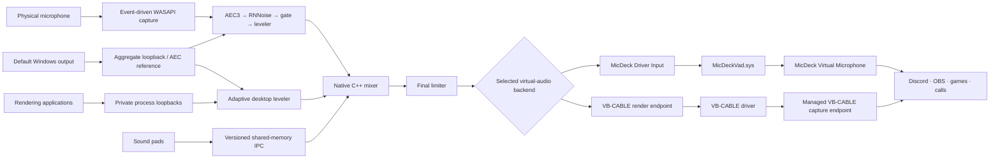

<p align="center">
  
</p>

<h1 align="center">MicDeck</h1>

<p align="center">
  <strong>A native Windows soundboard, voice processor, and system-audio router.</strong>
  <br>
  Trigger clips, share desktop audio, process your microphone, and send the complete mix through one managed virtual microphone.
</p>

<p align="center">
  <a href="README.pl.md">Polski</a>
  ·
  <a href="https://github.com/3godzinyL/MicDeck/releases/latest">Download</a>
  ·
  <a href="#signal-path">Signal path</a>
  ·
  <a href="#micdeck-vad-custom-driver">MicDeck VAD</a>
  ·
  <a href="CHANGELOG.md">Changelog</a>
</p>

<p align="center">
  <a href="https://github.com/3godzinyL/MicDeck/actions/workflows/ci.yml"></a>
  <a href="https://github.com/3godzinyL/MicDeck/releases/latest"></a>
  
  
  <a href="LICENSE"></a>
</p>

---

MicDeck replaces the usual stack of a soundboard, loopback recorder, voice processor, and virtual mixer with one focused application. Rust/Tauri owns the interface and lifecycle, while a separate native C++/WASAPI process owns the real-time audio path.

MicDeck now supports two virtual-audio backends:

- **MicDeck VAD** — the project's own WaveRT/PortCls virtual-audio driver;
- **VB-CABLE** — the compatibility backend based on the official VB-Audio package.

The backend can be selected in Settings. The native mixer does not contain backend-specific DSP: it renders the same final 48 kHz mix to whichever virtual endpoint is active.

No account. No telemetry. No cloud mixer. No DLL injection or process hooks.

## At a glance

| Area | Implementation |
| --- | --- |
| Platform | Windows 10/11 x64 |
| Inputs | Physical microphone, sound pads, aggregate desktop audio, private process loopbacks |
| Output | One managed virtual microphone |
| Virtual backends | MicDeck VAD or VB-CABLE |
| Audio core | C++20, event-driven WASAPI shared mode, MMCSS |
| Voice processing | WebRTC AEC3, RNNoise, smart gate, adaptive leveling/compression, limiter |
| Control layer | Rust + Tauri 2 |
| Driver core | C/C++, PortCls/WaveRT, bounded nonpaged audio pipeline |
| Internal stream | 48 kHz, stereo, 32-bit float |
| Interface | English and Polish |
| Network use for live audio | None |

## Features

- **Soundboard** — import and play MP3, WAV, FLAC, OGG, AAC, and M4A files.
- **Per-sound global hotkeys** — trigger clips while MicDeck is hidden in the tray.
- **System-audio sharing** — route YouTube, Spotify, games, or the full Windows render mix into voice chat.
- **Private application levels** — attenuate or mute selected applications only in MicDeck's outgoing mix.
- **Production voice chain** — AEC3, RNNoise, gate, adaptive level matching, compression, and limiting.
- **Streamer console** — compare microphone and desktop audio before and after processing against one target dBFS range.
- **Quick Capture** — import audio from supported YouTube, YouTube Shorts, and TikTok URLs.
- **Live diagnostics** — inspect signal levels, negotiated latency, engine state, process ID, underruns, and capture loss.
- **Dual virtual-audio backend** — switch between MicDeck VAD and VB-CABLE without changing the mixer or DSP graph.
- **Automatic route recovery** — reopen the selected WASAPI route after endpoint invalidation or a Windows Audio restart.
- **Windows integration** — optional launch at sign-in, close-to-tray behavior, and persistent background routing.
- **Local-first operation** — microphone and desktop audio stay on the computer.

## Interface

<table>
  <tr>
    <td width="50%">
      
    </td>
    <td width="50%">
      
    </td>
  </tr>
  <tr>
    <td align="center"><strong>Library</strong><br><sub>Sound pads, global hotkeys, search, playback, and background imports.</sub></td>
    <td align="center"><strong>Live Studio</strong><br><sub>Microphone, desktop audio, meters, monitoring, and route state.</sub></td>
  </tr>
  <tr>
    <td colspan="2">
      
    </td>
  </tr>
  <tr>
    <td colspan="2" align="center"><strong>Streamer console</strong><br><sub>Pre/post-DSP meters, target range, headphone calibration, microphone filters, and stream-bus gains.</sub></td>
  </tr>
  <tr>
    <td colspan="2">
      
    </td>
  </tr>
  <tr>
    <td colspan="2" align="center"><strong>Audio processing</strong><br><sub>Persistent cleanup, dynamics, safety ceiling, and an explicit real-time processing order.</sub></td>
  </tr>
</table>

## Download

Download the latest files from [GitHub Releases](https://github.com/3godzinyL/MicDeck/releases/latest):

| File | Use case |
| --- | --- |
| `MicDeck-Setup.exe` | Recommended per-user Windows installer. |
| `MicDeck-portable.exe` | Portable application build. A kernel audio driver still requires installation. |
| `SHA256SUMS.txt` | SHA-256 checksums for release files. |

Verify a downloaded file:

```powershell
Get-FileHash .\MicDeck-Setup.exe -Algorithm SHA256
```

### First run

1. Start MicDeck.
2. Open **Settings → Virtual audio backend**.
3. Select **MicDeck VAD** or the **VB-CABLE compatibility backend**.
4. Install the selected driver when Windows displays the UAC prompt.
5. Select your real physical microphone.
6. In Discord, OBS, a game, or another voice application, select the matching virtual microphone:
   - `MicDeck Virtual Microphone` for MicDeck VAD;
   - the managed VB-CABLE capture endpoint for VB-CABLE.
7. Add a sound or enable desktop-audio sharing in Live Studio.

Closing the main window keeps MicDeck in the Windows notification area and does not stop the route. Use **Quit / Zakończ** from the tray menu to exit normally.

> [!TIP]
> Voice-chat noise suppression, echo cancellation, and automatic gain control are designed for speech. If they cut music or effects, reduce or disable them for the MicDeck virtual microphone.

## Signal path

The application-side signal graph is identical for both virtual backends. Only the final render target changes.


```mermaid
flowchart LR
  mic["Physical microphone"] --> capture["Event-driven WASAPI capture"]
  desktop["Default Windows output"] --> loopback["Aggregate loopback / AEC reference"]
  apps["Rendering applications"] --> process["Private process loopbacks"]
  pads["Sound pads"] --> ipc["Versioned shared-memory IPC"]

  capture --> voice["AEC3 → RNNoise → gate → leveler"]
  loopback --> voice
  loopback --> desktopbus["Adaptive desktop leveler"]
  process --> desktopbus

  voice --> mixer["Native C++ mixer"]
  desktopbus --> mixer
  ipc --> mixer
  mixer --> limiter["Final limiter"]

  limiter --> backend{"Selected virtual-audio backend"}

  backend --> mdinput["MicDeck Driver Input"]
  mdinput --> mdvad["MicDeckVad.sys"]
  mdvad --> mdmic["MicDeck Virtual Microphone"]

  backend --> vbinput["VB-CABLE render endpoint"]
  vbinput --> vbcable["VB-CABLE driver"]
  vbcable --> vbmic["Managed VB-CABLE capture endpoint"]

  mdmic --> clients["Discord · OBS · games · calls"]
  vbmic --> clients
```

The C++ engine remains backend-agnostic. Rust resolves the selected render/capture endpoint IDs, sends one atomic configuration snapshot through the native bridge, and restarts the route only after the previous endpoint has been released.

## MicDeck VAD custom driver

MicDeck VAD is the project's own virtual-audio cable for Windows. It is implemented as a separate kernel driver package rather than code injected into the application.

### Driver endpoint graph


```mermaid
flowchart LR
  engine["soundboard_audio_engine.exe"] -->|WASAPI render| render["MicDeck Driver Input"]
  render --> waveout["WaveRT render miniport"]
  waveout --> decode["PCM/float boundary conversion"]
  decode --> pipeline["MdCablePipeline\n48 kHz stereo float"]
  pipeline --> encode["Capture format conversion"]
  encode --> wavein["WaveRT capture miniport"]
  wavein --> mic["MicDeck Virtual Microphone"]
  mic --> client["Discord · OBS · browser · game"]
```

### What happens inside the driver

1. **Normal Windows endpoints**  
   Windows sees a render endpoint named `MicDeck Driver Input` and a capture endpoint named `MicDeck Virtual Microphone`.

2. **Standard WASAPI connection**  
   The existing native engine renders to the driver through ordinary event-driven WASAPI. No custom audio IOCTL transport is required.

3. **WaveRT / PortCls miniports**  
   Separate render and capture miniports expose the two sides of the virtual cable and share one internal transport object.

4. **Canonical internal format**  
   The transport uses 48 kHz, stereo, 32-bit float. PCM16, PCM24, PCM32, mono, and stereo formats are converted at the endpoint boundary.

5. **Bounded nonpaged pipeline**  
   Audio travels through a preallocated single-producer/single-consumer ring stored in nonpaged kernel memory. The real-time path performs no file access, UI work, or unbounded allocation.

6. **Voice-oriented latency control**  
   The pipeline supports Ultra Low, Balanced, and Resilient queue policies. It primes the capture side before playback, trims stale audio after scheduling spikes, and returns to current speech instead of replaying a long delayed queue.

7. **Click-safe failure behavior**  
   Underflow produces initialized silence. Producer loss and discontinuities fade toward zero, and a restarted route begins with a clean queue rather than old audio.

8. **Diagnostics**  
   Versioned driver statistics expose active streams, queue depth, watermarks, written/read/dropped/discarded frames, silent frames, discontinuities, latency mode, and reset generation.

9. **Controlled installation**  
   The package consists of:
   - `MicDeckVad.sys`
   - `MicDeckVad.inf`
   - `MicDeckVad.cat`

   MicDeck verifies the packaged files and uses a fixed-operation elevated helper for status, install, repair, and uninstall. The helper is not a general command runner.

10. **Runtime recovery**  
    If Windows Audio restarts or an endpoint becomes invalid, the native engine releases the dead WASAPI clients, re-enumerates the selected backend, and retries the same route with bounded backoff.

### Driver package identity

```text
Hardware ID: ROOT\MICDECKVAD
Render endpoint: MicDeck Driver Input
Capture endpoint: MicDeck Virtual Microphone
Canonical stream: 48,000 Hz · stereo · float32
Driver model: WDM PortCls / WaveRT
```

## Real-time audio core

- `IAudioClient3` negotiates a low shared-mode engine period supported by each endpoint.
- Classic WASAPI initialization provides a fallback when `IAudioClient3` is unavailable.
- Capture and render use `AUDCLNT_STREAMFLAGS_EVENTCALLBACK`, not UI or JavaScript timers.
- Audio threads join Windows MMCSS with `Audio` / `Pro Audio` scheduling.
- Fixed-capacity SPSC rings use acquire/release atomics between producers and consumers.
- The mixing hot path uses fixed buffers and performs no webview work.
- Filter changes crossfade instead of replacing a processing graph in one sample.
- Per-process loopback levels affect only MicDeck's outgoing mix, never the user's Windows listening volume.

Actual end-to-end latency depends on the physical device, Windows audio engine, selected virtual backend, and client application. MicDeck reports negotiated and measured values rather than one fabricated universal number.

## Application and worker layer

Rust/Tauri owns:

- window and tray lifecycle;
- settings and backend persistence;
- sound library and metadata;
- hotkeys;
- driver package management;
- endpoint discovery;
- native-engine supervision;
- background imports and downloads.

The native bridge and audio engine are compiled during the Rust build and embedded into the application. At runtime they are restored into a content-addressed directory below `%LOCALAPPDATA%\micdeck\native\<hash>` and verified before reuse.

## Quick Capture

Supported sources:

- `youtube.com/watch/...`
- `youtube.com/shorts/...`
- `youtu.be/...`
- `tiktok.com/...`

URL import requires [`yt-dlp`](https://github.com/yt-dlp/yt-dlp) and [FFmpeg](https://ffmpeg.org/) in `PATH`. Run `scripts\install-tools.bat` to install both into the local tools directory.

Only download and broadcast media you are allowed to use. MicDeck does not bypass platform permissions, DRM, or copyright restrictions.

## Privacy and security

- Live microphone, sound-pad, and desktop audio is processed locally.
- MicDeck has no account system, analytics SDK, telemetry endpoint, or cloud audio service.
- It does not inject DLLs, hook another application's process, or inspect process memory.
- The webview receives a narrow Tauri capability allow-list.
- Native audio IPC uses a versioned mapping in the Windows local-session namespace.
- Driver packages and embedded native components are checked before privileged operations.
- The elevated driver helper accepts fixed operations instead of arbitrary commands.
- Certificates, private keys, generated SYS/CAT files, and local WDK output are excluded from source control.

Report vulnerabilities privately according to [SECURITY.md](SECURITY.md).

## Virtual-audio backends and third-party software

### MicDeck VAD

MicDeck VAD is developed as part of MicDeck. Its application integration, driver source, portable audio-core tests, packaging tools, and Windows certification scripts belong to the repository.

### VB-CABLE

MicDeck retains the official, unmodified **VB-CABLE Driver Pack 45** as a compatibility backend. VB-CABLE remains a separate VB-Audio product distributed under its own donationware and commercial licensing terms.

- [VB-CABLE product page](https://vb-audio.com/Cable/)
- [VB-Audio licensing terms](https://vb-audio.com/Services/licensing.htm)
- [Complete third-party notices](THIRD_PARTY_NOTICES.md)

`yt-dlp` and FFmpeg are optional external tools and retain their own licenses.

## Build from source

### Application requirements

- Windows 10/11 x64
- Node.js 24+
- Rust stable with the MSVC toolchain
- Visual Studio 2022 with **Desktop development with C++**
- Microsoft Edge WebView2 Runtime
- Optional: `yt-dlp` and FFmpeg

### Application development

```powershell
npm ci
npm run tauri dev
```

### Application production builds

```powershell
npm run build:portable
npm run build:installer
npm run build:all
```

Normal Tauri builds compile and embed the native C++ engine, shared-memory bridge, Rust DSP library, and fixed-operation driver helper.

### MicDeck VAD development

Building the kernel driver additionally requires:

- Windows Driver Kit matching the installed Windows SDK;
- CMake;
- a disposable Windows driver-test machine or VM;
- a test or production driver-signing workflow.

The driver project, portable core tests, package scripts, and end-to-end audio certifier are kept under the MicDeck VAD source tree. The generated signed `SYS/INF/CAT` package is staged into the application resources before a driver-enabled release build.

### Validation

```powershell
npm audit --audit-level=high
npm run build
cargo fmt --manifest-path src-tauri\Cargo.toml --all -- --check
cargo test --manifest-path src-tauri\Cargo.toml --locked
cargo clippy --manifest-path src-tauri\Cargo.toml --all-targets --locked -- -D warnings
```

Driver validation additionally covers the portable ring/pipeline tests, WDK build, INF verification, catalog generation, package signing, endpoint installation, render-to-capture audio verification, and Driver Verifier runs on a test system.

## Project layout

```text
src/                         Tauri web UI, localization, and interaction layer
src-tauri/                   Rust state, persistence, workers, lifecycle, and driver integration
native-audio/engine/         C++20 WASAPI capture, loopback, DSP, mixing, monitoring, and render
native-audio/bridge/         Versioned shared-memory IPC bridge
native-audio/selftest/       Hardware-independent native audio tests
drivers/micdeck-vad/         Custom WaveRT/PortCls driver, package, tests, tools, and documentation
scripts/                     Build, staging, release, dependency, and diagnostic helpers
docs/                        Screenshots, architecture notes, and release material
.github/                     CI, source-policy checks, issue forms, and templates
```

## Roadmap

- [x] Soundboard, desktop loopback, native mixer, and voice processing
- [x] Private per-process output levels
- [x] Selectable VB-CABLE / MicDeck VAD backend architecture
- [x] Custom render-to-capture WaveRT driver source and application integration
- [ ] Production driver signing and complete Windows certification matrix
- [ ] Multiple decks and profiles
- [ ] Stream Deck and MIDI control
- [ ] Authenticode-signed application builds and automatic updates
- [ ] Additional community translations

## Contributing

Bug reports, reproducible audio-device edge cases, accessibility improvements, documentation fixes, driver validation results, and focused pull requests are welcome.

Read [CONTRIBUTING.md](CONTRIBUTING.md) before opening a pull request. Include the Windows version, physical device names, selected virtual backend, engine state, negotiated latency, and underrun/discontinuity counts when reporting audio problems.

## License

MicDeck source code is available under the [MIT License](LICENSE). Bundled and optional third-party components retain their own licenses and distribution terms.

---

<p align="center">
  <strong>If MicDeck simplifies your voice-chat audio setup, consider starring the repository.</strong>
  <br>
  Stars help other Windows audio users discover the project.
</p>
