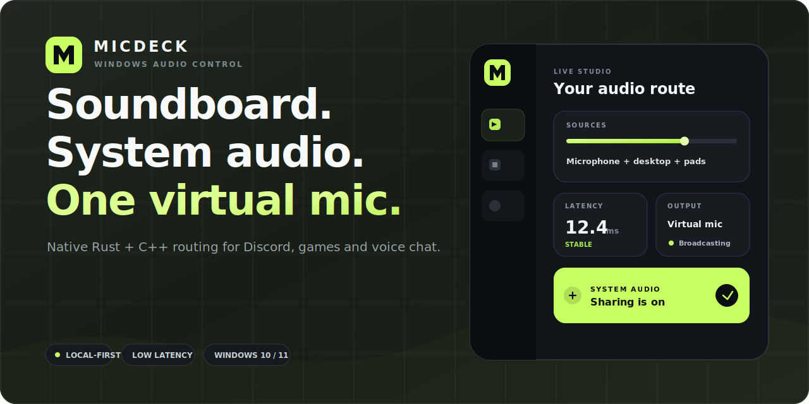
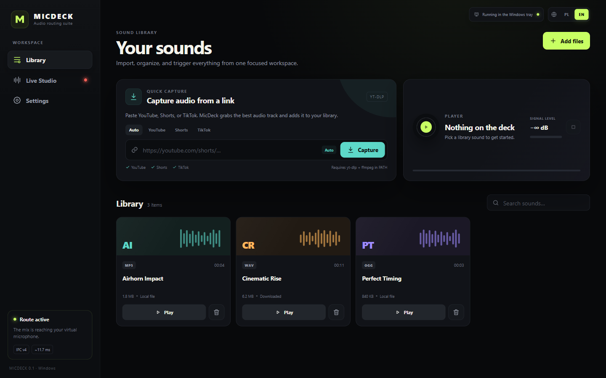
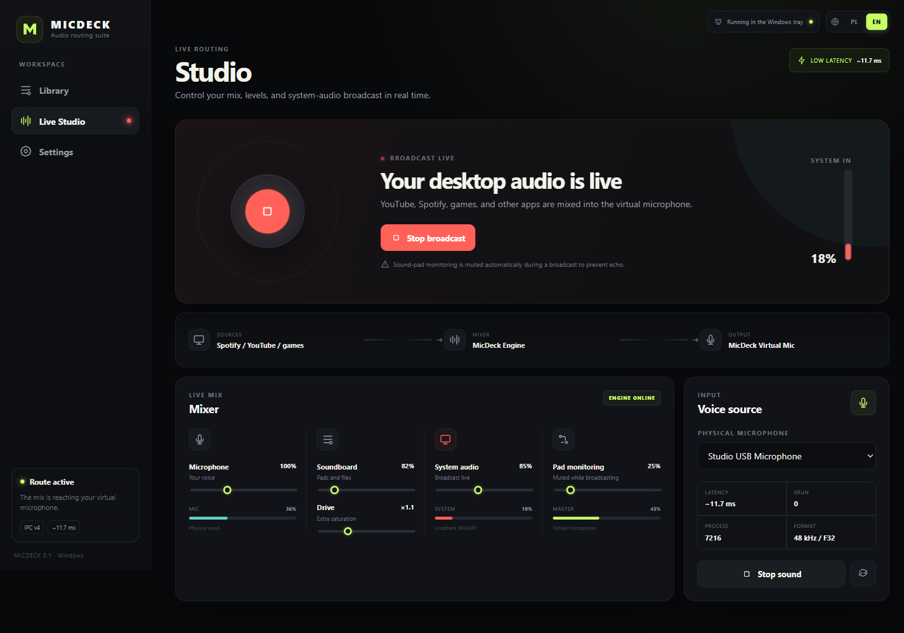
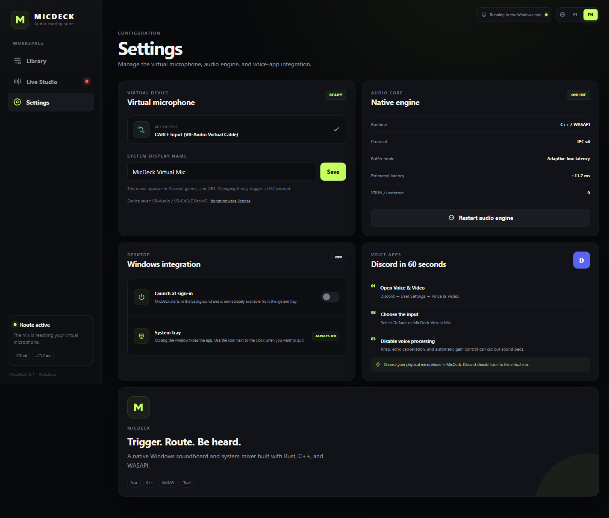
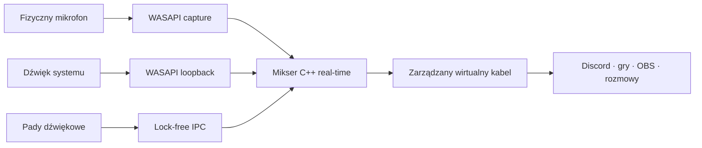

<p align="center">
  
</p>

<h1 align="center">MicDeck</h1>

<p align="center">
  <strong>Natywny soundboard i router dźwięku systemowego dla Windows.</strong>
  <br>
  Odpalaj klipy, udostępniaj to, co gra na komputerze, i wysyłaj cały miks przez jeden wirtualny mikrofon.
</p>

<p align="center">
  <a href="README.md">English</a>
  ·
  <a href="#pobieranie">Pobieranie</a>
  ·
  <a href="#jak-to-działa">Jak to działa</a>
  ·
  <a href="CHANGELOG.md">Changelog</a>
  ·
  <a href="CONTRIBUTING.md">Wkład w projekt</a>
</p>

---

MicDeck łączy soundboard, przechwytywanie dźwięku systemu i routing do komunikatorów w jednej aplikacji. Prosty interfejs działa na Tauri i Rust, a krytyczną ścieżkę audio obsługuje osobny silnik C++/WASAPI.

- **Dźwięk systemu jednym kliknięciem:** YouTube, Spotify, gra albo dowolna aplikacja trafia do Discorda.
- **Szybki soundboard:** MP3, WAV, FLAC, OGG, AAC i M4A na czytelnym live decku.
- **Quick Capture:** wklej YouTube, Shorts albo TikTok i dodaj audio do biblioteki.
- **Jeden miks:** mikrofon, klipy i dźwięk pulpitu wychodzą jako `MicDeck Virtual Mic`.
- **Adaptacyjne low latency:** `IAudioClient3` negocjuje okres dla konkretnego sprzętu zamiast stałego bufora 70 ms.
- **Integracja z Windows:** autostart, uruchamianie w tle i stała ikona w zasobniku systemowym.
- **Dwa języki:** cały interfejs przełącza się między polskim i angielskim z prawego górnego rogu.
- **Local-first:** bez konta, telemetrii, chmury, wstrzykiwania DLL i hooków procesów.

> [!NOTE]
> MicDeck jest obecnie publiczną wersją preview dla Windows 10/11 x64. Binariów jeszcze nie podpisano certyfikatem, dlatego Windows SmartScreen może pokazać ostrzeżenie.

## Wygląd aplikacji

<table>
  <tr>
    <td width="50%"></td>
    <td width="50%"></td>
  </tr>
  <tr>
    <td align="center"><strong>Biblioteka</strong><br><sub>Pady, wyszukiwarka, sterowanie odtwarzaniem i pobieranie z URL.</sub></td>
    <td align="center"><strong>Studio live</strong><br><sub>Mikrofon, system audio, mierniki, monitoring i status trasy.</sub></td>
  </tr>
  <tr>
    <td colspan="2"></td>
  </tr>
  <tr>
    <td colspan="2" align="center"><strong>Integracja z Windows</strong><br><sub>Wirtualny mikrofon, diagnostyka silnika, autostart, tray i instrukcja Discorda.</sub></td>
  </tr>
</table>

## Pobieranie

Wejdź w **Releases** po prawej stronie repozytorium i pobierz:

| Plik | Zastosowanie |
| --- | --- |
| `MicDeck-Setup.exe` | Wersja zalecana, instalowana dla aktualnego użytkownika. |
| `MicDeck-portable.exe` | Aplikacja bez instalacji; sterownik audio nadal może wymagać konfiguracji. |

### Pierwsze uruchomienie

1. Uruchom MicDeck i zaakceptuj instalator oficjalnego sterownika VB-CABLE, jeśli Windows o niego poprosi.
2. W **Ustawieniach** wybierz swój prawdziwy mikrofon.
3. W Discordzie lub grze ustaw wejście **MicDeck Virtual Mic**.
4. Dodaj klip albo przejdź do **Studio live** i włącz udostępnianie dźwięku systemu.
5. Opcjonalnie włącz **Uruchamiaj przy logowaniu** w sekcji **Ustawienia → Integracja z Windows**.

Zamknięcie okna ukrywa MicDeck w zasobniku systemowym obok zegara i nie przerywa routingu. Pełne wyjście jest dostępne w menu ikony jako **Quit / Zakończ**.

## Quick Capture

Obsługiwane są adresy YouTube, YouTube Shorts, `youtu.be` i TikTok. Import wymaga `yt-dlp` oraz `ffmpeg` w `PATH`; skrypt `scripts\install-tools.bat` instaluje oba narzędzia lokalnie.

Pobieraj i udostępniaj wyłącznie materiały, do których masz prawa. MicDeck nie omija zabezpieczeń platform i nie nadaje licencji do cudzych treści.

## Jak to działa



Warstwa Rust/Tauri odpowiada za UI, bibliotekę, zapis ustawień, pobieranie i cykl życia sterownika. Osobny silnik C++20 realizuje event-driven capture, loopback, miksowanie, monitoring i render. Wersjonowany most pamięci współdzielonej trzyma pracę interfejsu z dala od wątku real-time.

MicDeck pyta urządzenia o obsługiwane okresy shared mode i dobiera niski, stabilny okres blisko minimum sprzętu. Gdy `IAudioClient3` nie jest dostępne, używa bezpiecznego okresu domyślnego. Studio pokazuje szacowane opóźnienie i underruny.

## Build ze źródeł

Wymagania: Windows 10/11 x64, Node.js 24+, Rust stable MSVC, Visual Studio 2022 Build Tools z **Desktop development with C++** oraz WebView2 Runtime.

```powershell
npm ci
npm run tauri dev
```

Build produkcyjny:

```powershell
npm run build:portable
npm run build:installer
```

Testy:

```powershell
npm run build
cargo test --manifest-path src-tauri\Cargo.toml --locked
```

## Roadmap

- [ ] Przechwytywanie dźwięku z wybranej aplikacji
- [ ] Normalizacja, limiter i lekki EQ
- [ ] Wiele decków i profili
- [ ] Globalne hotkeye, Stream Deck i MIDI
- [ ] Podpisane buildy i automatyczne aktualizacje
- [ ] Kolejne tłumaczenia społeczności

## Bezpieczeństwo, wkład i licencja

Audio jest przetwarzane lokalnie. Zgłoszenia bezpieczeństwa opisuje [SECURITY.md](SECURITY.md), zasady kontrybucji [CONTRIBUTING.md](CONTRIBUTING.md), a zależności zewnętrzne [THIRD_PARTY_NOTICES.md](THIRD_PARTY_NOTICES.md).

Kod MicDeck jest dostępny na [licencji MIT](LICENSE). Zewnętrzne komponenty zachowują własne warunki.

---

<p align="center">
  <strong>Jeśli MicDeck upraszcza Ci audio na Discordzie, zostaw gwiazdkę.</strong>
  <br>
  Dzięki temu projekt ma większą szansę dotrzeć do kolejnych osób.
</p>
