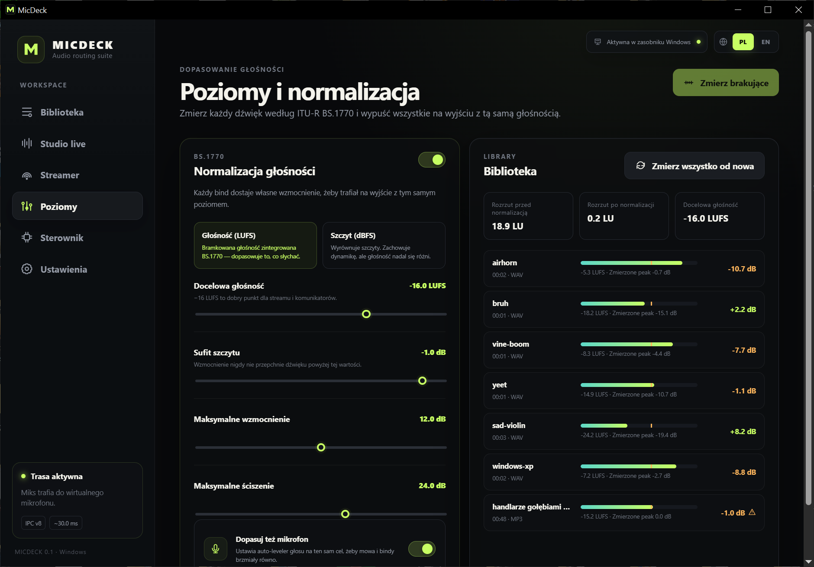
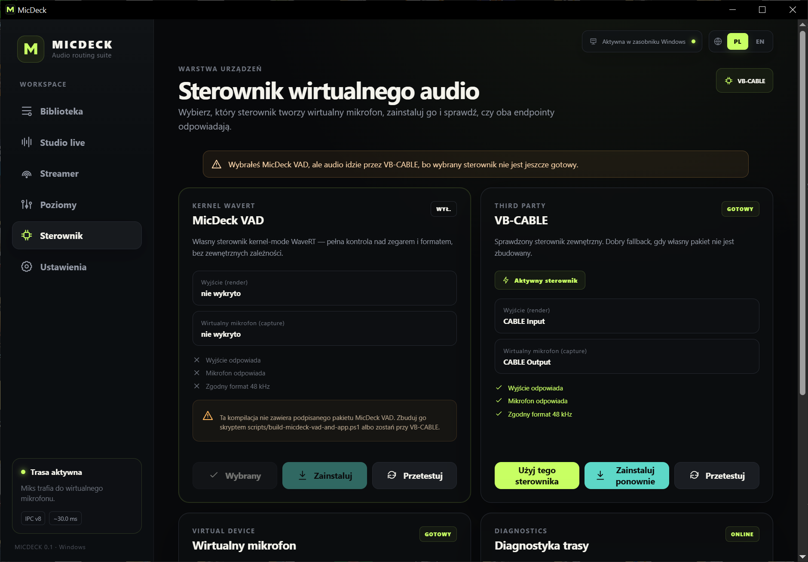
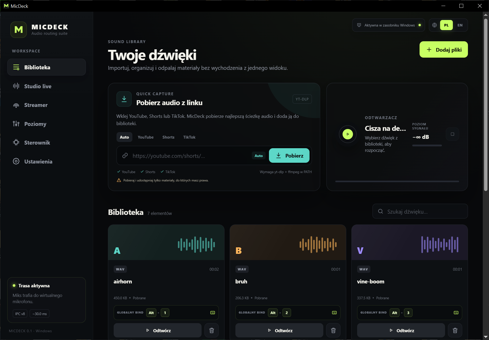
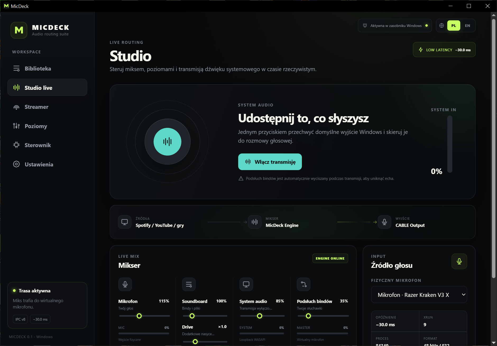
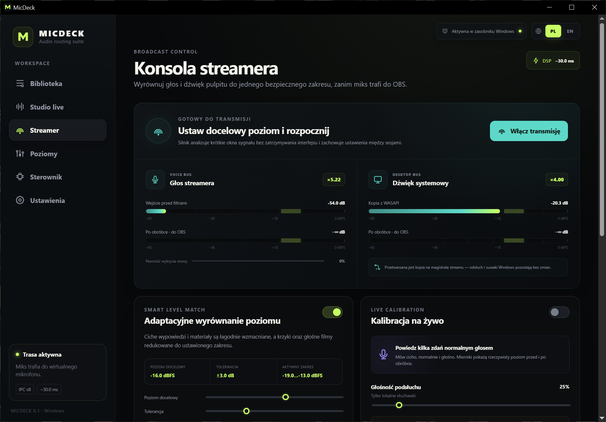
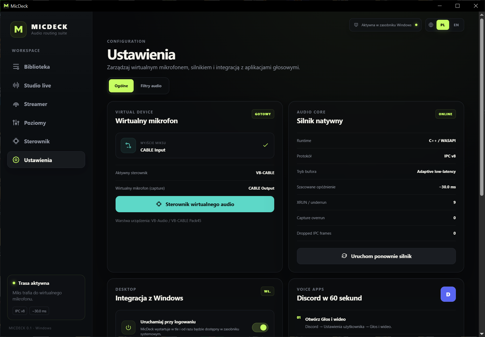

<p align="center">
  
</p>

<h1 align="center">MicDeck</h1>

<p align="center">
  <strong>Konsoleta audio dla Windows — z własnym sterownikiem kernel-mode.</strong>
  <br>
  Odpalaj bindy, udostępniaj to, co gra na PC, wyrównaj wszystko do jednej głośności
  <br>
  i wypuść cały miks przez jeden wirtualny mikrofon.
</p>

<p align="center">
  <a href="README.md">English</a>
  ·
  <a href="#dopasowanie-głośności">Normalizacja</a>
  ·
  <a href="#sterownik-micdeck-vad">Sterownik</a>
  ·
  <a href="#ścieżka-sygnału">Ścieżka sygnału</a>
  ·
  <a href="#struktura-projektu">Struktura</a>
  ·
  <a href="#budowanie-ze-źródeł">Budowanie</a>
  ·
  <a href="CHANGELOG.md">Changelog</a>
</p>

<p align="center">
  <a href="https://github.com/3godzinyL/MicDeck/actions/workflows/ci.yml"></a>
  
  
  
  
  <a href="LICENSE"></a>
</p>

---

MicDeck to soundboard, przechwytywanie dźwięku Windows, broadcastowy leveler głośności i
router wirtualnego mikrofonu w jednej aplikacji. Interfejs jest celowo mały; osobny natywny
proces C++/WASAPI trzyma ścieżkę real-time, a wirtualny kabel zapewnia własny sterownik
kernel-mode WaveRT.

**Bez konta. Bez telemetrii. Bez chmury. Bez wstrzykiwania kodu i hooków w procesy.**

## W skrócie

| | |
| --- | --- |
| Platforma | Windows 10 2004+ / 11, x64 |
| Wejścia | Mikrofon fizyczny, bindy, domyślne wyjście Windows (loopback) |
| Wyjście | Jeden wirtualny mikrofon — **MicDeck VAD** (własny sterownik) albo VB-CABLE |
| Głośność | Bramkowana głośność zintegrowana ITU-R BS.1770-4, gain per dźwięk, dopasowanie mikrofonu |
| Rdzeń real-time | Osobny proces C++20 / WASAPI, 48 kHz float, okres notyfikacji ~10 ms |
| Powłoka | Rust + Tauri 2, front w czystym JS (bez frameworka, bez dołączanego runtime) |
| Języki | Polski i angielski, przełączane w locie |

## Najważniejsze rzeczy

### Dopasowanie głośności

Każdy dźwięk jest raz mierzony pełną implementacją **ITU-R BS.1770-4** — filtry K-weighting
wyprowadzane z prototypu analogowego (więc materiał 44,1 kHz nie jest źle ważony), bloki
400 ms z 75 % nakładaniem i dwustopniowa bramka bezwzględna/względna. Zakładka Poziomy
nakłada potem gain per dźwięk, żeby wszystko wychodziło na szynę miksu z tym samym
odczuwanym poziomem — z ograniczeniem, które nigdy nie przepchnie sygnału ponad sufit szczytu.

<p align="center">
  
</p>

> Biblioteka wyżej ma **18,9 LU** różnicy między najcichszym a najgłośniejszym dźwiękiem.
> Z włączoną normalizacją rozrzut po gainie to **0,2 LU** — i o to w tej zakładce chodzi.

Opcjonalnie ten sam cel steruje auto-levelerem mikrofonu, żeby mowa i bindy siedziały na
jednym poziomie zamiast się przekrzykiwać.

### Sterownik MicDeck VAD

MicDeck ma własny sterownik **WaveRT** w trybie jądra zamiast zależności od firm trzecich.
Zakładka Sterownik pozwala wybrać backend, zainstalować go i sprawdzić, czy oba endpointy
faktycznie odpowiadają — z VB-CABLE utrzymanym jako działający fallback.

<p align="center">
  
</p>

Zrzut pokazuje uczciwe zachowanie: MicDeck VAD jest wybranym backendem, ale ta kompilacja nie
ma podpisanego pakietu, więc audio dalej płynie przez VB-CABLE, a interfejs mówi dokładnie
dlaczego.

### Reszta

- **Soundboard** z globalnymi skrótami, podglądem waveformu i importem jednym kliknięciem.
- **Quick Capture** — wklej link YouTube / Shorts / TikTok, dźwięk ląduje w bibliotece.
- **Transmisja dźwięku systemowego** — Spotify, gra albo rozmowa w tym samym miksie.
- **Głośność per aplikacja** — widok Studio listuje żywe sesje audio z własnymi suwakami.
- **Łańcuch DSP głosu** — AEC3, RNNoise, bramka szumów, auto-leveler, kompresor, limiter.
- **Siedzi w zasobniku**, umie autostart i nie wchodzi w drogę.

## Interfejs

<table>
  <tr>
    <td width="50%"></td>
    <td width="50%"></td>
  </tr>
  <tr>
    <td align="center"><strong>Biblioteka</strong> — bindy, skróty, Quick Capture</td>
    <td align="center"><strong>Studio</strong> — mikser live i transmisja systemu</td>
  </tr>
  <tr>
    <td width="50%"></td>
    <td width="50%"></td>
  </tr>
  <tr>
    <td align="center"><strong>Streamer</strong> — kalibracja i level match</td>
    <td align="center"><strong>Ustawienia</strong> — silnik, integracja z Windows, poradniki</td>
  </tr>
</table>

## Ścieżka sygnału

```
 mikrofon ─────┐
               │   ┌──────────────────────────────────────────────┐
 bindy ────────┼──▶│  soundboard_audio_engine.exe  (C++20/WASAPI) │
               │   │                                              │
 loopback      │   │   AEC3 → RNNoise → bramka → leveler → limiter│
 Windows ──────┘   │   + gain BS.1770 per dźwięk na szynie bindów │
                   └───────────────────┬──────────────────────────┘
                                       │  48 kHz float, ~10 ms
                                       ▼
                   ┌──────────────────────────────────────────────┐
                   │  MicDeck VAD  (kernel WaveRT)  albo VB-CABLE │
                   │  endpoint render ──▶ ring SPSC ──▶ capture   │
                   └───────────────────┬──────────────────────────┘
                                       ▼
                        Discord / OBS / Teams / cokolwiek
```

Proces Rust/Tauri nigdy nie dotyka ścieżki real-time. Dekoduje pliki, mierzy głośność,
trzyma stan i gada z silnikiem przez most IPC na pamięci współdzielonej
(`soundboard_ipc.dll`). Jak silnik padnie, UI żyje dalej i go restartuje.

## Sterownik MicDeck VAD

`drivers/micdeck-vad` to kompletne wirtualne urządzenie audio PortCls/WaveRT: endpoint
render („MicDeck Driver Input") i endpoint capture („MicDeck Virtual Microphone") połączone
bezblokadowym ringiem w non-paged pool.

**Rzeczy warte uwagi w projekcie:**

- **Jeden pisarz na kursor.** Producent jest właścicielem `write_frame_`, konsument
  `read_frame_` i nic innego nie może do nich pisać. Flush jest *zgłaszany* ze ścieżki
  sterującej, a *wykonywany* przez konsumenta — bo zapis z wątku sterującego ścigający się z
  DPC, który już wczytał kursor, zostawia głowicę odczytu przed zapisem, a endpoint milknie
  wtedy na tyle, ile trwała sesja.
- **Stan synchronizowany epoką.** Tryb latencji, aktywność producenta/konsumenta i
  ponowne primowanie idą przez atomową epokę; maszyna stanów fade jest wyłącznie prywatna
  dla konsumenta.
- **Prime / fade / trim.** Konsument czeka na realny zapas na jitter zanim ruszy (więcej niż
  jeden okres notyfikacji), wchodzi i wychodzi z nieciągłości fadem zamiast trzaskiem i
  przycina zwietrzałe audio, gdy kolejka się wydłuża.
- **Trzy tryby latencji** — UltraLow (prime 5 ms), Balanced (15 ms), Resilient (30 ms) —
  przełączane w locie prywatnym property setem KS, razem ze statystykami ringu.
- **Zero założeń o CRT.** Obiekty statyczne są `constinit`, a tablice formatów mają
  inicjalizację stałą, więc dynamiczny inicjator, który w kernelu i tak by nie wystartował,
  jest błędem kompilacji, a nie zagadką przy starcie systemu.

Katalog `shared/` kompiluje się i do sterownika, i do binarki testowej w usermode, więc ring
i pipeline są pokryte zwykłymi asercjami, które lecą w kilka sekund.

> **Status wydania.** Sterownik kompiluje się i linkuje czysto, a jego logika ma testy —
> włącznie z regresją na opisany wyżej wyścig flush. Zbudowanie instalowalnego `.sys`
> wymaga dodatkowo WDK i certyfikatu do podpisu
> (`scripts/build-micdeck-vad-and-app.ps1`). Kompilacje bez osadzonego podpisanego pakietu
> raportują MicDeck VAD jako niedostępny i schodzą na VB-CABLE — bez cichej awarii.

## Struktura projektu

```
micdeck/
├── src/                              Front — czysty JS, bez frameworka
│   ├── main.js                       Widoki, stan, wywołania IPC, zdarzenia
│   ├── i18n.js                       Teksty PL + EN
│   └── styles.css                    Cały system designu
│
├── src-tauri/                        Powłoka w Ruście
│   ├── src/
│   │   ├── lib.rs                    Stan aplikacji, komendy Tauri, tray, skróty
│   │   ├── loudness.rs               Miernik ITU-R BS.1770-4 (K-weighting + bramka)
│   │   ├── virtual_audio.rs          Wykrywanie backendów, instalacja, zmiana nazwy
│   │   └── native_audio.rs           FFI do silnika C++, dekodowanie i push
│   ├── build.rs                      Buduje silnik natywny, stage'uje pakiet sterownika
│   ├── resources/
│   │   ├── micdeck-vad/package/      Tu ląduje podpisany pakiet (poza gitem)
│   │   └── vbcable/                  Oficjalne archiwum VB-CABLE + SHA-256
│   └── tauri.conf.json
│
├── native-audio/                     Rdzeń audio real-time
│   ├── engine/src/                   WASAPI capture/render, mikser, monitor sesji
│   ├── bridge/                       Most IPC na pamięci współdzielonej
│   ├── dsp/                          Biblioteka DSP w Ruście (AEC3, RNNoise, dynamika)
│   ├── protocol/                     Wersjonowane struktury IPC
│   └── selftest/                     Testy natywne niezależne od sprzętu
│
├── drivers/micdeck-vad/              Sterownik audio w trybie jądra
│   ├── driver/src/
│   │   ├── driver.cpp                DriverEntry, AddDevice, łańcuch unload
│   │   ├── adapter.cpp               Rejestracja subdevice'ów + połączenia fizyczne
│   │   ├── endpoint_descriptors.cpp  Tablice pinów / filtrów / zakresów danych
│   │   ├── miniport_wave_rt*.cpp     Miniport WaveRT, strumień, transfer w DPC
│   │   ├── miniport_topology.cpp     Miniport topologii
│   │   ├── virtual_cable.cpp         Własność ringu, stan strumieni, statystyki
│   │   ├── format.cpp                Tablica KSDATAFORMAT (inicjalizacja stała)
│   │   ├── audio_clock.cpp           Zegar pozycji strumienia
│   │   ├── master_clock.cpp          Wspólny zegar zakotwiczony w QPC
│   │   ├── property_handlers.cpp     Prywatny property set KS (statystyki, latencja)
│   │   ├── power_management.cpp      Przejścia D0/D3
│   │   ├── guids.cpp                 Jedyna jednostka z initguid.h
│   │   └── new_delete.cpp            operator new/delete z tagiem puli
│   ├── shared/                       Kompiluje się i w kernelu, i w usermode
│   │   ├── micdeck_audio_core.*      Ring SPSC, konwersja formatów, atomiki
│   │   └── micdeck_cable_pipeline.*  Polityka prime / fade / trim
│   ├── integration/
│   │   ├── driver-helper/            Instalator SetupAPI/DIFx z podniesieniem uprawnień
│   │   ├── micdeck-native/           Wykrywanie endpointów + kontroler reconnectu
│   │   └── tauri-rust/               Referencyjne bindingi w Ruście
│   ├── package/MicDeckVad.inf        INF (interfejsy rejestrowane per subdevice)
│   ├── tests/                        Testy usermode dla kodu współdzielonego
│   ├── tools/                        vadctl, tone-probe, e2e-certifier
│   ├── scripts/                      Budowanie, podpis, instalacja, bramki certyfikacji
│   └── docs/                         Architektura, bring-up, model bezpieczeństwa
│
├── scripts/                          Budowanie i pakowanie aplikacji
│   ├── build-micdeck-vad-and-app.ps1 Sterownik + aplikacja za jednym razem
│   ├── stage-micdeck-vad-package.ps1 Weryfikuje podpisy, pisze manifest
│   └── tauri.mjs                     Cele portable / installer
│
└── docs/                             Zrzuty ekranu, release notes
```

## Budowanie ze źródeł

### Wymagania

| Komponent | Do czego |
| --- | --- |
| Rust (stable, toolchain MSVC) | Powłoka aplikacji |
| Node.js 20+ | Build frontu |
| Visual Studio 2022 + „Desktop development with C++" | Silnik natywny i sterownik |
| Windows SDK 10.0.22621+ | Nagłówki i biblioteki kernela |
| Windows Driver Kit (WDK) | Zbudowanie instalowalnego `.sys` |
| yt-dlp + ffmpeg w `PATH` | Quick Capture (opcjonalnie) |

### Uruchomienie

```bash
npm install
npm run tauri dev
```

`build.rs` kompiluje po drodze silnik C++ i helper instalacyjny, więc pierwszy build trwa.
Do tej ścieżki WDK nie jest potrzebne — aplikacja działa na VB-CABLE.

### Wydanie

```powershell
npm run build:portable                     # pojedynczy portable .exe
npm run build:installer                    # instalator NSIS
.\scripts\build-micdeck-vad-and-app.ps1    # sterownik + podpisany pakiet + aplikacja
```

### Weryfikacja

```bash
# Rust: kalibracja BS.1770, limity normalizacji, integralność pakietu sterownika
cargo test --manifest-path src-tauri/Cargo.toml --lib

# Logika sterownika: ring, regresja wyścigu flush, prime/fade/trim, konwersja formatów
drivers\micdeck-vad\scripts\build-portable-tests.cmd

# Sterownik kompiluje się czysto w trybie jądra
drivers\micdeck-vad\scripts\driver-syntax.cmd

# Sterownik linkuje się czysto — łapie nierozwiązane symbole i statyczne inicjatory
drivers\micdeck-vad\scripts\driver-link.cmd
```

Implementacja BS.1770 jest przypięta do punktu kalibracyjnego samej normy: sinus 1 kHz o
poziomie 0 dBFS w jednym kanale pary stereo musi dać **−3,01 LKFS**. Jak współczynniki
K-weighting albo offset −0,691 kiedykolwiek odjadą, ten test padnie.

## Prywatność i bezpieczeństwo

- Bez konta, bez telemetrii, bez połączeń sieciowych innych niż pobrania Quick Capture,
  które sam uruchamiasz.
- Osadzone archiwum VB-CABLE jest weryfikowane po SHA-256 zanim w ogóle zostanie rozpakowane.
- Pakiet MicDeck VAD jest sprawdzany względem podpisanego manifestu przed instalacją, a
  helper z podniesionymi uprawnieniami startuje wyłącznie ze świeżo przygotowanego katalogu
  tymczasowego.
- Instalacja sterownika to zawsze świadoma akcja użytkownika — start aplikacji tylko *wykrywa*.
- Żadnych hooków w procesach, wstrzykiwania kodu ani przechwytywania cudzego audio.

## Roadmapa

- [ ] Pakiet MicDeck VAD podpisany Authenticode/EV w pipelinie wydań
- [ ] Automatyczne odzyskiwanie po odłączeniu i podłączeniu urządzenia audio
- [ ] Przechwytywanie per aplikacja (jedna apka zamiast całego pulpitu)
- [ ] Wiele decków i profili
- [ ] Sterowanie ze Stream Decka i MIDI
- [ ] Kolejne tłumaczenia od społeczności

## Oprogramowanie firm trzecich

VB-CABLE to donationware autorstwa VB-Audio, redystrybuowane bez modyfikacji na własnych
warunkach (`src-tauri/resources/vbcable/NOTICE.md`). Jak z niego korzystasz, wspomóż autora —
MicDeck VAD istnieje po to, żeby ta zależność była opcjonalna, a nie żeby nikt za nią nie
zapłacił. Pełne atrybucje w [THIRD_PARTY_NOTICES.md](THIRD_PARTY_NOTICES.md).

## Współpraca

Issues i pull requesty mile widziane — zobacz [CONTRIBUTING.md](CONTRIBUTING.md) i
[Kodeks postępowania](CODE_OF_CONDUCT.md). Cokolwiek dotykającego sterownika albo
współdzielonego ringu powinno mieć test w `drivers/micdeck-vad/tests`. Zgłaszając problem z
dźwiękiem, dorzuć status silnika, wersję Windows, nazwy urządzeń, wynegocjowaną latencję i
licznik underrunów z zakładki Sterownik.

## Licencja

MIT — zobacz [LICENSE](LICENSE). Dołączone i opcjonalne komponenty firm trzecich zachowują
własne licencje i warunki dystrybucji.

---

<p align="center">
  <strong>Jeśli MicDeck ogarnia Ci audio na rozmowach, zostaw gwiazdkę.</strong>
</p>
