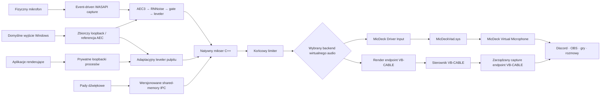

<p align="center">
  
</p>

<h1 align="center">MicDeck</h1>

<p align="center">
  <strong>Natywny soundboard, procesor głosu i router audio dla Windows.</strong>
  <br>
  Odpalaj klipy, udostępniaj dźwięk pulpitu, obrabiaj mikrofon i wysyłaj kompletny miks przez jeden zarządzany wirtualny mikrofon.
</p>

<p align="center">
  <a href="README.md">English</a>
  ·
  <a href="https://github.com/3godzinyL/MicDeck/releases/latest">Pobierz</a>
  ·
  <a href="#ścieżka-sygnału">Ścieżka sygnału</a>
  ·
  <a href="#micdeck-vad--własny-sterownik">MicDeck VAD</a>
  ·
  <a href="CHANGELOG.md">Changelog</a>
</p>

<p align="center">
  <a href="https://github.com/3godzinyL/MicDeck/actions/workflows/ci.yml"></a>
  <a href="https://github.com/3godzinyL/MicDeck/releases/latest"></a>
  
  
  <a href="LICENSE"></a>
</p>

---

MicDeck zastępuje typowy zestaw złożony z osobnego soundboardu, loopback recordera, procesora głosu i skomplikowanego wirtualnego miksera. Rust/Tauri obsługuje interfejs i cykl życia aplikacji, a osobny natywny proces C++/WASAPI przejmuje całą ścieżkę audio czasu rzeczywistego.

MicDeck obsługuje dwa backendy wirtualnego audio:

- **MicDeck VAD** — własny sterownik WaveRT/PortCls rozwijany razem z projektem;
- **VB-CABLE** — kompatybilnościowy backend korzystający z oficjalnej paczki VB-Audio.

Backend wybiera się w Ustawieniach. Mikser i DSP nie mają osobnej logiki dla sterownika: ten sam gotowy miks 48 kHz jest renderowany do aktualnie wybranego wirtualnego endpointu.

Bez konta. Bez telemetrii. Bez miksera w chmurze. Bez wstrzykiwania DLL i hooków procesów.

## W skrócie

| Obszar | Implementacja |
| --- | --- |
| Platforma | Windows 10/11 x64 |
| Źródła | Fizyczny mikrofon, pady, zbiorczy dźwięk pulpitu, prywatne loopbacki procesów |
| Wyjście | Jeden zarządzany wirtualny mikrofon |
| Backend wirtualnego audio | MicDeck VAD albo VB-CABLE |
| Rdzeń audio | C++20, event-driven WASAPI shared mode, MMCSS |
| Obróbka głosu | WebRTC AEC3, RNNoise, smart gate, adaptacyjne wyrównanie/kompresja, limiter |
| Warstwa sterująca | Rust + Tauri 2 |
| Rdzeń sterownika | C/C++, PortCls/WaveRT, ograniczony nonpaged audio pipeline |
| Strumień wewnętrzny | 48 kHz, stereo, 32-bit float |
| Interfejs | Polski i angielski |
| Sieć dla live audio | Brak |

## Funkcje

- **Soundboard** — import i odtwarzanie MP3, WAV, FLAC, OGG, AAC oraz M4A.
- **Globalny bind dla każdego dźwięku** — odpalanie klipów także po schowaniu aplikacji do traya.
- **Udostępnianie dźwięku systemu** — YouTube, Spotify, gra albo pełny miks renderowany przez Windows.
- **Prywatne poziomy aplikacji** — ściszanie wybranych programów wyłącznie w miksie wychodzącym z MicDecka.
- **Produkcyjny tor głosu** — AEC3, RNNoise, gate, adaptacyjne wyrównanie, kompresja i limiter.
- **Konsola Streamer** — porównanie mikrofonu oraz pulpitu przed i po obróbce względem jednego zakresu dBFS.
- **Quick Capture** — import audio z obsługiwanych linków YouTube, Shorts i TikTok.
- **Diagnostyka live** — poziomy sygnału, wynegocjowana latencja, stan engine'u, PID, underruny i utrata ramek.
- **Dwa backendy wirtualnego audio** — przełączanie MicDeck VAD / VB-CABLE bez przebudowy miksera i DSP.
- **Automatyczny reconnect** — ponowne otwarcie wybranej trasy po unieważnieniu endpointu lub restarcie Windows Audio.
- **Integracja z Windows** — autostart, close-to-tray i routing działający w tle.
- **Local-first** — mikrofon i dźwięk pulpitu pozostają na komputerze.

## Wygląd aplikacji

<table>
  <tr>
    <td width="50%">
      
    </td>
    <td width="50%">
      
    </td>
  </tr>
  <tr>
    <td align="center"><strong>Biblioteka</strong><br><sub>Pady, globalne bindy, wyszukiwarka, odtwarzanie i import w tle.</sub></td>
    <td align="center"><strong>Studio live</strong><br><sub>Mikrofon, dźwięk pulpitu, mierniki, monitoring i stan trasy.</sub></td>
  </tr>
  <tr>
    <td colspan="2">
      
    </td>
  </tr>
  <tr>
    <td colspan="2" align="center"><strong>Konsola Streamer</strong><br><sub>Mierniki przed i po DSP, zakres docelowy, kalibracja słuchawkowa, filtry mikrofonu i gain magistrali streamu.</sub></td>
  </tr>
  <tr>
    <td colspan="2">
      
    </td>
  </tr>
  <tr>
    <td colspan="2" align="center"><strong>Obróbka audio</strong><br><sub>Trwałe ustawienia oczyszczania, dynamiki, limitera bezpieczeństwa i jawna kolejność realtime.</sub></td>
  </tr>
</table>

## Pobieranie

Najnowsze pliki są dostępne w [GitHub Releases](https://github.com/3godzinyL/MicDeck/releases/latest):

| Plik | Zastosowanie |
| --- | --- |
| `MicDeck-Setup.exe` | Zalecany instalator dla aktualnego użytkownika Windows. |
| `MicDeck-portable.exe` | Wersja przenośna aplikacji. Sterownik kernelowy nadal wymaga instalacji. |
| `SHA256SUMS.txt` | Sumy SHA-256 plików wydania. |

Sprawdzenie instalatora:

```powershell
Get-FileHash .\MicDeck-Setup.exe -Algorithm SHA256
```

### Pierwsze uruchomienie

1. Uruchom MicDeck.
2. Otwórz **Ustawienia → Backend wirtualnego audio**.
3. Wybierz **MicDeck VAD** albo kompatybilnościowy **VB-CABLE**.
4. Zainstaluj wybrany sterownik po pokazaniu przez Windows okna UAC.
5. Wybierz swój prawdziwy mikrofon.
6. W Discordzie, OBS, grze albo komunikatorze wybierz odpowiedni mikrofon:
   - `MicDeck Virtual Microphone` dla MicDeck VAD;
   - zarządzany capture endpoint VB-CABLE dla backendu VB-CABLE.
7. Dodaj dźwięk albo włącz udostępnianie pulpitu w Studio live.

Zamknięcie głównego okna ukrywa MicDeck w zasobniku systemowym i nie przerywa routingu. Pełne wyjście jest dostępne jako **Quit / Zakończ** w menu traya.

> [!TIP]
> Redukcja szumu, echo cancellation i automatyczna regulacja gainu w komunikatorach są projektowane pod mowę. Gdy wycinają muzykę albo efekty, zmniejsz je lub wyłącz dla wirtualnego mikrofonu MicDeck.

## Ścieżka sygnału

Graf aplikacji jest taki sam dla obu backendów. Zmienia się wyłącznie końcowy render endpoint.


```mermaid
flowchart LR
  mic["Fizyczny mikrofon"] --> capture["Event-driven WASAPI capture"]
  desktop["Domyślne wyjście Windows"] --> loopback["Zbiorczy loopback / referencja AEC"]
  apps["Aplikacje renderujące"] --> process["Prywatne loopbacki procesów"]
  pads["Pady dźwiękowe"] --> ipc["Wersjonowane shared-memory IPC"]

  capture --> voice["AEC3 → RNNoise → gate → leveler"]
  loopback --> voice
  loopback --> desktopbus["Adaptacyjny leveler pulpitu"]
  process --> desktopbus

  voice --> mixer["Natywny mikser C++"]
  desktopbus --> mixer
  ipc --> mixer
  mixer --> limiter["Końcowy limiter"]

  limiter --> backend{"Wybrany backend wirtualnego audio"}

  backend --> mdinput["MicDeck Driver Input"]
  mdinput --> mdvad["MicDeckVad.sys"]
  mdvad --> mdmic["MicDeck Virtual Microphone"]

  backend --> vbinput["Render endpoint VB-CABLE"]
  vbinput --> vbcable["Sterownik VB-CABLE"]
  vbcable --> vbmic["Zarządzany capture endpoint VB-CABLE"]

  mdmic --> clients["Discord · OBS · gry · rozmowy"]
  vbmic --> clients
```

Engine C++ pozostaje niezależny od backendu. Rust znajduje identyfikatory render/capture wybranego urządzenia, przekazuje jeden atomowy snapshot konfiguracji przez natywny bridge i uruchamia nową trasę dopiero po zwolnieniu poprzedniego endpointu.

## MicDeck VAD — własny sterownik

MicDeck VAD jest własnym wirtualnym kablem audio projektu dla Windows. Działa jako osobny pakiet sterownika kernelowego, a nie kod wstrzykiwany do DLL aplikacji.

### Sieć wewnątrz sterownika


```mermaid
flowchart LR
  engine["soundboard_audio_engine.exe"] -->|WASAPI render| render["MicDeck Driver Input"]
  render --> waveout["WaveRT render miniport"]
  waveout --> decode["Konwersja PCM/float na granicy endpointu"]
  decode --> pipeline["MdCablePipeline\n48 kHz stereo float"]
  pipeline --> encode["Konwersja formatu capture"]
  encode --> wavein["WaveRT capture miniport"]
  wavein --> mic["MicDeck Virtual Microphone"]
  mic --> client["Discord · OBS · przeglądarka · gra"]
```

### Jak sterownik działa

1. **Normalne urządzenia Windows**  
   System widzi render endpoint `MicDeck Driver Input` oraz capture endpoint `MicDeck Virtual Microphone`.

2. **Standardowe połączenie WASAPI**  
   Istniejący natywny engine renderuje do sterownika przez zwykłe event-driven WASAPI. Dźwięk nie jest przesyłany niestandardowym IOCTL-em.

3. **Miniporty WaveRT / PortCls**  
   Oddzielny miniport render i capture tworzą dwie strony kabla i współdzielą jeden wewnętrzny transport.

4. **Wewnętrzny format kanoniczny**  
   Transport pracuje w 48 kHz, stereo, 32-bit float. PCM16, PCM24, PCM32, mono i stereo są konwertowane na granicy endpointu.

5. **Ograniczony nonpaged pipeline**  
   Audio przechodzi przez prealokowany ring single-producer/single-consumer w pamięci nonpaged. Ścieżka realtime nie wykonuje dostępu do plików, pracy UI ani nieograniczonych alokacji.

6. **Kontrola opóźnienia pod rozmowy**  
   Pipeline ma profile Ultra Low, Balanced i Resilient. Capture jest primowany przed odtwarzaniem, stary dźwięk po skoku schedulera jest przycinany, a sterownik wraca do aktualnej mowy zamiast odtwarzać długą opóźnioną kolejkę.

7. **Bezklikowe zachowanie po błędzie**  
   Underflow daje zainicjalizowaną ciszę. Utrata producenta i discontinuity schodzą łagodnie do zera, a ponownie uruchomiona trasa zaczyna od czystej kolejki.

8. **Diagnostyka**  
   Wersjonowane statystyki obejmują aktywne streamy, głębokość kolejki, watermarki, ramki zapisane/odczytane/upuszczone/odrzucone, ciszę, discontinuity, tryb latencji i generację resetu.

9. **Kontrolowana instalacja**  
   Pakiet zawiera:
   - `MicDeckVad.sys`
   - `MicDeckVad.inf`
   - `MicDeckVad.cat`

   MicDeck weryfikuje pliki pakietu i używa wąskiego helpera uruchamianego z UAC do operacji status/install/repair/uninstall. Helper nie jest ogólnym wykonawcą komend.

10. **Odzyskiwanie trasy**  
    Po restarcie Windows Audio albo unieważnieniu endpointu engine zwalnia martwe klienty WASAPI, ponownie enumeruje wybrany backend i otwiera tę samą trasę z ograniczonym backoffem.

### Tożsamość pakietu

```text
Hardware ID: ROOT\MICDECKVAD
Render endpoint: MicDeck Driver Input
Capture endpoint: MicDeck Virtual Microphone
Strumień kanoniczny: 48 000 Hz · stereo · float32
Model sterownika: WDM PortCls / WaveRT
```

## Rdzeń audio czasu rzeczywistego

- `IAudioClient3` negocjuje niski okres shared mode obsługiwany przez konkretny endpoint.
- Klasyczna inicjalizacja WASAPI jest fallbackiem, gdy `IAudioClient3` nie jest dostępne.
- Capture i render korzystają z `AUDCLNT_STREAMFLAGS_EVENTCALLBACK`, a nie timerów UI/JavaScript.
- Wątki audio dołączają do Windows MMCSS w klasie `Audio` / `Pro Audio`.
- Ring buffery o stałej pojemności korzystają z atomików acquire/release.
- Hot path miksera używa stałych buforów i nie wykonuje pracy webview.
- Zmiany filtrów przechodzą crossfade, zamiast wymieniać graf w jednej próbce.
- Poziomy prywatnych loopbacków zmieniają tylko miks MicDecka, nigdy odsłuch użytkownika w Windows.

Rzeczywista latencja zależy od fizycznego urządzenia, Windows Audio Engine, wybranego backendu i programu odbierającego. MicDeck pokazuje wartości wynegocjowane oraz mierzone zamiast jednej zmyślonej liczby.

## Warstwa aplikacji i workerów

Rust/Tauri obsługuje:

- cykl życia okna i traya;
- ustawienia oraz zapis backendu;
- bibliotekę dźwięków i metadane;
- globalne bindy;
- zarządzanie pakietem sterownika;
- wykrywanie endpointów;
- nadzorowanie natywnego engine'u;
- importy i pobieranie w tle.

Native bridge i engine audio są kompilowane podczas buildu Rust i osadzane w aplikacji. Przy uruchomieniu trafiają do katalogu content-addressed pod `%LOCALAPPDATA%\micdeck\native\<hash>` i są sprawdzane przed ponownym użyciem.

## Quick Capture

Obsługiwane źródła:

- `youtube.com/watch/...`
- `youtube.com/shorts/...`
- `youtu.be/...`
- `tiktok.com/...`

Import z URL wymaga [`yt-dlp`](https://github.com/yt-dlp/yt-dlp) oraz [FFmpeg](https://ffmpeg.org/) w `PATH`. Skrypt `scripts\install-tools.bat` instaluje oba narzędzia lokalnie.

Pobieraj i udostępniaj wyłącznie materiały, do których masz prawa. MicDeck nie omija uprawnień platform, DRM ani praw autorskich.

## Prywatność i bezpieczeństwo

- Mikrofon, pady i dźwięk pulpitu są przetwarzane lokalnie.
- Brak konta, analytics SDK, telemetrii i chmurowego serwisu audio.
- Brak wstrzykiwania DLL, hookowania procesów i czytania pamięci aplikacji.
- Webview ma wąską listę capability Tauri.
- Native IPC używa wersjonowanego mappingu w lokalnej sesji Windows.
- Pakiety sterowników i osadzone komponenty są sprawdzane przed operacjami uprzywilejowanymi.
- Elevated helper akceptuje wyłącznie ustalone operacje, a nie dowolne polecenia.
- Certyfikaty, klucze prywatne, wygenerowane SYS/CAT i lokalny output WDK są wykluczone z repozytorium.

Podatności zgłaszaj prywatnie zgodnie z [SECURITY.md](SECURITY.md).

## Backendy i oprogramowanie zewnętrzne

### MicDeck VAD

MicDeck VAD jest rozwijany jako część MicDecka. Repozytorium obejmuje integrację aplikacyjną, źródła sterownika, przenośne testy rdzenia audio, narzędzia pakowania i skrypty walidacji Windows.

### VB-CABLE

MicDeck zachowuje oficjalną, niemodyfikowaną paczkę **VB-CABLE Driver Pack 45** jako backend kompatybilnościowy. VB-CABLE pozostaje osobnym produktem VB-Audio z własnym modelem donationware i licencjami komercyjnymi.

- [Strona VB-CABLE](https://vb-audio.com/Cable/)
- [Warunki licencji VB-Audio](https://vb-audio.com/Services/licensing.htm)
- [Pełne informacje o komponentach zewnętrznych](THIRD_PARTY_NOTICES.md)

`yt-dlp` i FFmpeg są opcjonalnymi zewnętrznymi narzędziami i zachowują własne licencje.

## Build ze źródeł

### Wymagania aplikacji

- Windows 10/11 x64
- Node.js 24+
- Rust stable z toolchainem MSVC
- Visual Studio 2022 z **Desktop development with C++**
- Microsoft Edge WebView2 Runtime
- Opcjonalnie `yt-dlp` i FFmpeg

### Development aplikacji

```powershell
npm ci
npm run tauri dev
```

### Buildy produkcyjne aplikacji

```powershell
npm run build:portable
npm run build:installer
npm run build:all
```

Normalny build Tauri automatycznie kompiluje i osadza engine C++, shared-memory bridge, bibliotekę DSP Rust oraz fixed-operation driver helper.

### Development MicDeck VAD

Kompilacja sterownika kernelowego wymaga dodatkowo:

- Windows Driver Kit zgodnego z Windows SDK;
- CMake;
- jednorazowej maszyny albo VM do testów sterownika;
- testowego albo produkcyjnego procesu podpisywania sterowników.

Projekt sterownika, testy przenośnego rdzenia, skrypty pakowania i certyfikator end-to-end znajdują się w drzewie źródeł MicDeck VAD. Wygenerowany podpisany pakiet `SYS/INF/CAT` jest stage'owany do zasobów aplikacji przed wydaniem obsługującym własny sterownik.

### Walidacja

```powershell
npm audit --audit-level=high
npm run build
cargo fmt --manifest-path src-tauri\Cargo.toml --all -- --check
cargo test --manifest-path src-tauri\Cargo.toml --locked
cargo clippy --manifest-path src-tauri\Cargo.toml --all-targets --locked -- -D warnings
```

Walidacja sterownika obejmuje dodatkowo testy ring/pipeline, build WDK, weryfikację INF, generowanie katalogu CAT, podpis pakietu, instalację endpointów, test audio render→capture i Driver Verifier na systemie testowym.

## Struktura projektu

```text
src/                         Web UI Tauri, tłumaczenia i warstwa interakcji
src-tauri/                   Stan Rust, zapis ustawień, workery, lifecycle i integracja sterownika
native-audio/engine/         C++20 WASAPI capture, loopback, DSP, mikser, monitoring i render
native-audio/bridge/         Wersjonowany bridge shared-memory IPC
native-audio/selftest/       Niezależne od sprzętu testy natywnego audio
drivers/micdeck-vad/         Własny sterownik WaveRT/PortCls, pakiet, testy, narzędzia i dokumentacja
scripts/                     Build, staging, release, zależności i diagnostyka
docs/                        Screenshoty, opisy architektury i materiały wydania
.github/                     CI, source-policy checks, formularze issue i szablony
```

## Roadmapa

- [x] Soundboard, desktop loopback, natywny mikser i obróbka głosu
- [x] Prywatne poziomy pojedynczych aplikacji
- [x] Architektura przełączanych backendów VB-CABLE / MicDeck VAD
- [x] Źródła własnego sterownika render→capture i integracja z aplikacją
- [ ] Produkcyjny podpis sterownika i pełna macierz certyfikacji Windows
- [ ] Wiele decków i profile
- [ ] Sterowanie Stream Deck i MIDI
- [ ] Podpisane Authenticode buildy aplikacji i automatyczne aktualizacje
- [ ] Kolejne tłumaczenia społeczności

## Współtworzenie

Mile widziane są zgłoszenia błędów, powtarzalne przypadki urządzeń audio, poprawki dostępności i dokumentacji, wyniki walidacji sterownika oraz skupione pull requesty.

Przed PR-em przeczytaj [CONTRIBUTING.md](CONTRIBUTING.md). W zgłoszeniach audio podaj wersję Windows, nazwy urządzeń fizycznych, wybrany backend, stan engine'u, wynegocjowaną latencję oraz liczniki underrun/discontinuity.

## Licencja

Kod źródłowy MicDecka jest dostępny na [licencji MIT](LICENSE). Osadzone i opcjonalne komponenty zewnętrzne zachowują własne licencje oraz warunki dystrybucji.

---

<p align="center">
  <strong>Jeśli MicDeck upraszcza ci konfigurację audio, zostaw gwiazdkę repozytorium.</strong>
  <br>
  Gwiazdki pomagają innym użytkownikom Windows znaleźć projekt.
</p>
